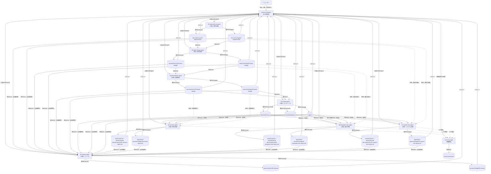
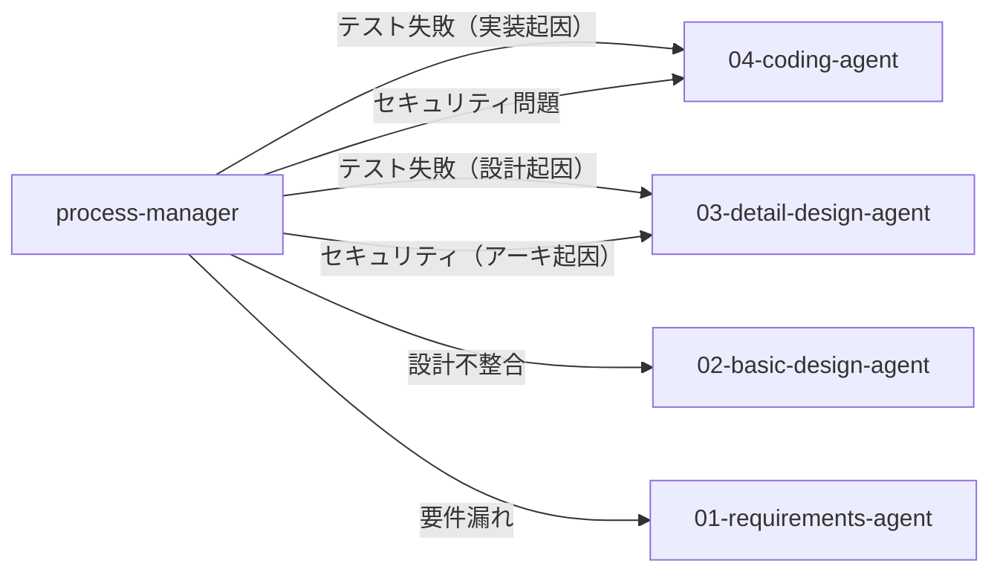

# Webシステム開発 — エージェント構成

## エージェント一覧

| エージェント | 種別 | 役割 | 成果物管理フォルダ |
|------------|------|------|-----------------|
| `process-manager` | **ユーザー向け（唯一）** | 全工程統括・自動チェック・手動レビュー・対話的差し戻し | `documents/progress.json` |
| `issue-manager` | サブエージェント | 課題・バグ・リスク登録管理 | `issues/` |
| `01-requirements-agent` | サブエージェント（工程1） | 要件定義 + チェックプログラム作成 | `documents/sys/01-requirements/`, `documents/app/01-requirements/`, `.github/checks/phase-01-check.py` |
| `02-basic-design-agent` | サブエージェント（工程2） | 基本設計 + チェックプログラム作成 | `documents/sys/02-basic-design/`, `documents/app/02-basic-design/`, `.github/checks/phase-02-check.py` |
| `03-detail-design-agent` | サブエージェント（工程3） | 詳細設計 + チェックプログラム作成 | `documents/sys/03-detail-design/`, `documents/app/03-detail-design/`, `.github/checks/phase-03-check.py` |
| `04-coding-agent` | サブエージェント（工程4） | コーディング + チェックプログラム作成 | `frontend/src/sys/`, `backend/app/sys/`, `apps/<app-name>/`, `.github/checks/phase-04-check.py` |
| `05-unit-test-agent` | サブエージェント（工程5） | 単体評価 + チェックプログラム作成 | `tests/frontend/`, `tests/backend/`, `documents/sys/05-unit-test-report.md`, `documents/app/05-unit-test-report.md`, `.github/checks/phase-05-check.py` |
| `06-integration-test-agent` | サブエージェント（工程6） | 結合評価 + チェックプログラム作成 | `tests/frontend/`, `tests/backend/`, `documents/sys/06-integration-test-report.md`, `documents/app/06-integration-test-report.md`, `.github/checks/phase-06-check.py` |
| `07-system-test-agent` | サブエージェント（工程7） | システム評価 + チェックプログラム作成 | `tests/frontend/`, `tests/backend/`, `documents/sys/07-system-test-report.md`, `documents/app/07-system-test-report.md`, `.github/checks/phase-07-check.py` |
| `08-release-agent` | サブエージェント（工程8） | リリース + チェックプログラム作成 | `documents/sys/08-release/`, `documents/app/08-release/`, `.github/checks/phase-08-check.py` |
| `agent-builder` | メタエージェント | エージェント・スキル・プロンプト設計生成 | `.github/agents/`, `.github/skills/` |
| `requirement-analyst` | メタエージェント（サブ） | エージェント要件分析・ヒアリング | — |
| `file-generator` | メタエージェント（サブ） | カスタマイズファイル生成・書き込み | `.github/` |

> **原則**: 各成果物フォルダは担当エージェントのみ書き込み可。他のエージェント・ユーザーは読み取り専用。

---

## 成果物オーナーシップ（参照権限）

### 原則
- **設計工程（A01〜A04）**: 直前工程の成果物のみ参照
- **テスト工程（A05〜A07）**: V字工程に準拠し、対応する設計工程の成果物を参照
  - A05（単体テスト） → 詳細設計（工程3）を検証
  - A06（結合テスト） → 基本設計（工程2）を検証
  - A07（システムテスト） → 要件定義（工程1）を検証
- **process-manager** は全成果物を参照してレビュー・差し戻し判断
- **A08（リリース）** は全成果物参照（リリースノート作成のため）

### 参照権限一覧

| エージェント | 読み取り可能 | 書き込み可能 | 備考 |
|------------|------------|------------|------|
| `01-requirements-agent` | `requests/` | `documents/sys/01-requirements/`, `documents/app/01-requirements/`, `.github/checks/common/phase-01-check.py` | 初期工程（sys/app並行）+ チェックプログラム作成 |
| `02-basic-design-agent` | `documents/sys/01-requirements/`, `documents/app/01-requirements/` | `documents/sys/02-basic-design/`, `documents/app/02-basic-design/`, `.github/checks/common/phase-02-check.py` | 要件を基に設計 + チェックプログラム作成 |
| `03-detail-design-agent` | `documents/sys/02-basic-design/`, `documents/app/02-basic-design/` | `documents/sys/03-detail-design/`, `documents/app/03-detail-design/`, `.github/checks/common/phase-03-check.py` | 基本設計を詳細化 + チェックプログラム作成 |
| `04-coding-agent` | `documents/sys/03-detail-design/`, `documents/app/03-detail-design/` | `frontend/src/sys/`, `backend/app/sys/`, `apps/<app-name>/`, `.github/checks/common/phase-04-check.py` | 詳細設計を実装 + チェックプログラム作成 |
| `05-unit-test-agent` | `frontend/src/sys/`, `backend/app/sys/`, `apps/<app-name>/`, `documents/sys/03-detail-design/`, `documents/app/03-detail-design/` | `tests/frontend/`, `tests/backend/`, `apps/<app-name>/tests/`, `documents/sys/05-unit-test-report.md`, `documents/app/05-unit-test-report.md`, `.github/checks/common/phase-05-check.py` | 詳細設計通りに実装されているか検証 + チェックプログラム作成 |
| `06-integration-test-agent` | `frontend/src/sys/`, `backend/app/sys/`, `apps/<app-name>/`, `documents/sys/02-basic-design/`, `documents/app/02-basic-design/` | `tests/frontend/`, `tests/backend/`, `apps/<app-name>/tests/`, `documents/sys/06-integration-test-report.md`, `documents/app/06-integration-test-report.md`, `.github/checks/common/phase-06-check.py` | 基本設計（API・連携）通りか検証 + チェックプログラム作成 |
| `07-system-test-agent` | `frontend/src/sys/`, `backend/app/sys/`, `apps/<app-name>/`, `documents/sys/01-requirements/`, `documents/app/01-requirements/` | `tests/frontend/`, `tests/backend/`, `apps/<app-name>/tests/`, `documents/sys/07-system-test-report.md`, `documents/app/07-system-test-report.md`, `.github/checks/common/phase-07-check.py` | 要件定義を満たしているか検証 + チェックプログラム作成 |
| `08-release-agent` | **全成果物** | `documents/sys/08-release/`, `documents/app/08-release/`, `.github/checks/common/phase-08-check.py` | リリースノート作成 + チェックプログラム作成 |
| `process-manager` | **全成果物**, `.github/checks/` | `documents/progress.json` | 全体統括・自動チェック実行・手動レビュー・対話的差し戻し |
| `issue-manager` | **全成果物**（読み取り専用） | `issues/issues.json` | 課題管理 |

> **注**: 各エージェントは自身の成果物フォルダ内のファイルを読み書き可能。他のフォルダへの書き込みは禁止。

---

## 連携フロー



---

## 差し戻しフロー



---

## ディレクトリ構成（参考）

```
websys/
├── agents.md               ← このファイル（エージェント構成）
├── requests/               ← ユーザーが置く要求仕様・議事録
├── documents/              ← 全設計書・テストレポート（エージェントが生成）
│   ├── progress.json       ← process-manager が管理
│   ├── sys/                ← システム共通基盤の設計書
│   │   ├── 01-requirements/
│   │   ├── 02-basic-design/
│   │   ├── 03-detail-design/
│   │   ├── 05-unit-test-report.md
│   │   ├── 06-integration-test-report.md
│   │   ├── 07-system-test-report.md
│   │   └── 08-release/
│   └── app/                ← アプリケーションの設計書
│       ├── 01-requirements/
│       ├── 02-basic-design/
│       ├── 03-detail-design/
│       ├── 05-unit-test-report.md
│       ├── 06-integration-test-report.md
│       ├── 07-system-test-report.md
│       └── 08-release/
├── frontend/                        ← システム共通基盤フロント（04-coding-agent が生成）
│   ├── src/
│   │   └── sys/                    ← システム共通基盤UI（認証・共通コンポーネント）
│   ├── public/
│   ├── package.json
│   └── vite.config.ts
├── backend/                         ← システム共通基盤バックエンド（04-coding-agent が生成）
│   ├── app/
│   │   └── sys/                    ← システム共通基盤
│   │       ├── api/                ← システム共通API（認証など）
│   │       ├── dal/                ← データアクセス層
│   │       ├── core/               ← 認証・共通機能
│   │       └── models/             ← 共通データモデル
│   ├── data/                       ← システム共通データ（JSON DB）
│   └── requirements.txt
├── apps/                            ← アプリケーション（完全独立構成）
│   └── <app-name>/                 ← 各アプリ（04-coding-agent が生成）
│       ├── manifest.json           ← アプリメタ情報
│       ├── frontend/               ← アプリ専用フロント
│       │   ├── src/
│       │   ├── package.json
│       │   └── vite.config.ts
│       ├── backend/                ← アプリ専用バックエンド
│       │   ├── app/
│       │   │   ├── api/           ← アプリ固有API
│       │   │   └── models/        ← アプリ固有モデル
│       │   ├── data/              ← アプリ固有データ（JSON DB）
│       │   └── requirements.txt
│       └── tests/                  ← アプリ専用テスト
│           ├── frontend/
│           └── backend/
├── tests/                           ← システム共通基盤テスト
│   ├── frontend/
│   └── backend/
├── issues/
│   └── issues.json         ← issue-manager が管理
└── .github/
    ├── agents/             ← エージェント定義
    ├── skills/             ← スキル（専門知識）
    ├── prompts/            ← プロンプトテンプレート
    └── checks/             ← チェックプログラム（各工程エージェントが作成）
```

---

## process-manager のレビュープロセス

各工程完了後、process-manager は以下の3段階でレビューを実施する：

### 1. 自動チェック（チェックプログラム自動実行）
process-manager がチェックプログラムを自動実行し、結果ファイルを確認：

```bash
python .github/checks/common/phase-XX-check.py
# → .github/checks/common/phase-XX-result.json に結果を出力
```

process-manager が結果ファイル（`.github/checks/common/phase-XX-result.json`）を読み取り、以下を確認：
- `status` が `"pass"` → 自動チェック合格
- `status` が `"fail"` → エラー内容を確認し、該当エージェントに修正依頼

**検証項目**：
- ファイル存在確認
- 必須項目の記載漏れチェック
- ID相互参照の整合性（トレーサビリティ）
- フォーマット違反の検出

### 2. 手動レビュー（成果物内容確認）
process-manager が実際に成果物ファイルを読み込み、以下を確認：

| 観点 | 確認項目 |
|------|----------|
| **完全性** | 全ての必須項目が記載されているか |
| **整合性** | 前工程の成果物と矛盾がないか |
| **具体性** | 次工程が作業可能な詳細度か |
| **妥当性** | 技術的に実現可能で適切な設計か |

### 3. 対話的差し戻し
問題が発見された場合：
1. **根本原因の分析**（実装起因 / 設計起因 / 要件起因）
2. **該当エージェントの再呼び出し**（具体的な問題箇所・修正方針を伝達）
3. **修正完了後、レビューを再実行**
4. **差し戻し記録**（`documents/progress.json` + `issue-manager`）

---

## チェックプログラムの仕様

各工程エージェントは成果物生成と同時に以下の仕様でチェックプログラムを作成する：

| 項目 | 仕様 |
|------|------|
| **言語** | Python 3.9+ |
| **依存** | 標準ライブラリのみ |
| **配置** | `.github/checks/common/phase-XX-check.py` |
| **出力先** | `.github/checks/common/phase-XX-result.json` |
| **出力形式** | JSON `{"status": "pass"\|"fail", "errors": [], "warnings": [], "timestamp": "...", "phase": "XX"}` |
| **終了コード** | 0（成功）/ 1（失敗） |
| **検証項目** | ファイル存在・ID重複・相互参照・フォーマット |
| **実行者** | process-manager（自動実行） |

**例（工程1）**：
- `documents/sys/01-requirements/requirements.md` の存在確認
- 要件ID（FR-SYS-XXX, FR-APP-XXX）の重複チェック
- use-cases.md と acceptance-criteria.md の相互参照確認
- 結果を `.github/checks/common/phase-01-result.json` に出力
```
