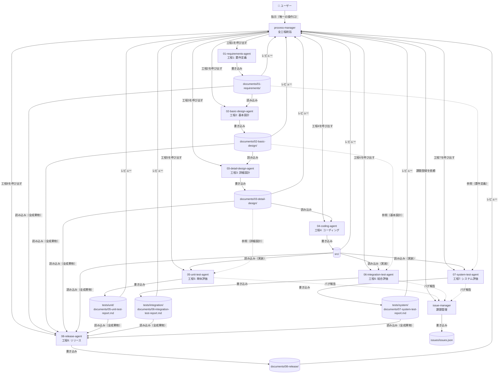
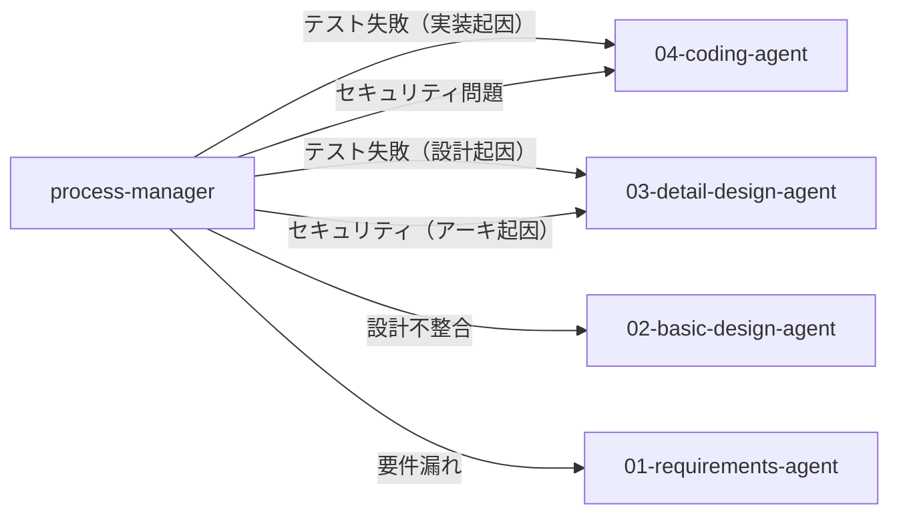

# Webシステム開発 — エージェント構成

## エージェント一覧

| エージェント | 種別 | 役割 | 成果物管理フォルダ |
|------------|------|------|-----------------|
| `process-manager` | **ユーザー向け（唯一）** | 全工程統括・レビュー・差し戻し判断 | `documents/progress.json` |
| `issue-manager` | サブエージェント | 課題・バグ・リスク登録管理 | `issues/` |
| `01-requirements-agent` | サブエージェント（工程1） | 要件定義 | `documents/01-requirements/` |
| `02-basic-design-agent` | サブエージェント（工程2） | 基本設計 | `documents/02-basic-design/` |
| `03-detail-design-agent` | サブエージェント（工程3） | 詳細設計 | `documents/03-detail-design/` |
| `04-coding-agent` | サブエージェント（工程4） | コーディング | `src/` |
| `05-unit-test-agent` | サブエージェント（工程5） | 単体評価 | `tests/unit/`, `documents/05-unit-test-report.md` |
| `06-integration-test-agent` | サブエージェント（工程6） | 結合評価 | `tests/integration/`, `documents/06-integration-test-report.md` |
| `07-system-test-agent` | サブエージェント（工程7） | システム評価 | `tests/system/`, `documents/07-system-test-report.md` |
| `08-release-agent` | サブエージェント（工程8） | リリース | `documents/08-release/` |
| `agent-builder` | メタエージェント | エージェント・スキル・プロンプト設計生成 | `.github/agents/`, `.github/skills/` |
| `requirement-analyst` | メタエージェント（サブ） | エージェント要件分析・ヒアリング | — |
| `file-generator` | メタエージェント（サブ） | カスタマイズファイル生成・書き込み | `.github/` |

> **原則**: 各成果物フォルダは担当エージェントのみ書き込み可。他のエージェント・ユーザーは読み取り専用。

---

## 成果物オーナーシップ（参照権限）

### 原則
- **設計工程（A01〜A04）**: 直前工程の成果物のみ参照
- **テスト工程（A05〜A07）**: V字工程に準拠し、対応する設計工程の成果物を参照
  - A05（単体テスト） → 詳細設計（工程3）を検証
  - A06（結合テスト） → 基本設計（工程2）を検証
  - A07（システムテスト） → 要件定義（工程1）を検証
- **process-manager** は全成果物を参照してレビュー・差し戻し判断
- **A08（リリース）** は全成果物参照（リリースノート作成のため）

### 参照権限一覧

| エージェント | 読み取り可能 | 書き込み可能 | 備考 |
|------------|------------|------------|------|
| `01-requirements-agent` | `requests/` | `documents/01-requirements/` | 初期工程 |
| `02-basic-design-agent` | `documents/01-requirements/` | `documents/02-basic-design/` | 要件を基に設計 |
| `03-detail-design-agent` | `documents/02-basic-design/` | `documents/03-detail-design/` | 基本設計を詳細化 |
| `04-coding-agent` | `documents/03-detail-design/` | `src/` | 詳細設計を実装 |
| `05-unit-test-agent` | `src/`, `documents/03-detail-design/` | `tests/unit/`, `documents/05-unit-test-report.md` | 詳細設計通りに実装されているか検証 |
| `06-integration-test-agent` | `src/`, `documents/02-basic-design/` | `tests/integration/`, `documents/06-integration-test-report.md` | 基本設計（API・連携）通りか検証 |
| `07-system-test-agent` | `src/`, `documents/01-requirements/` | `tests/system/`, `documents/07-system-test-report.md` | 要件定義を満たしているか検証 |
| `08-release-agent` | **全成果物** | `documents/08-release/` | リリースノート作成 |
| `process-manager` | **全成果物** | `documents/progress.json` | 全体統括・レビュー |
| `issue-manager` | **全成果物**（読み取り専用） | `issues/issues.json` | 課題管理 |

> **注**: 各エージェントは自身の成果物フォルダ内のファイルを読み書き可能。他のフォルダへの書き込みは禁止。

---

## 連携フロー



---

## 差し戻しフロー



---

## ディレクトリ構成（参考）

```
websys/
├── agents.md               ← このファイル（エージェント構成）
├── requests/               ← ユーザーが置く要求仕様・議事録
├── documents/              ← 全設計書・テストレポート（エージェントが生成）
│   ├── progress.json       ← process-manager が管理
│   ├── 01-requirements/
│   ├── 02-basic-design/
│   ├── 03-detail-design/
│   ├── 05-unit-test-report.md
│   ├── 06-integration-test-report.md
│   ├── 07-system-test-report.md
│   └── 08-release/
├── src/                    ← 実装ソース（04-coding-agent が生成）
│   ├── system/
│   └── apps/
├── tests/
│   ├── unit/
│   ├── integration/
│   └── system/
├── issues/
│   └── issues.json         ← issue-manager が管理
└── .github/
    ├── agents/             ← エージェント定義
    ├── skills/             ← スキル（専門知識）
    └── prompts/            ← プロンプトテンプレート
```
