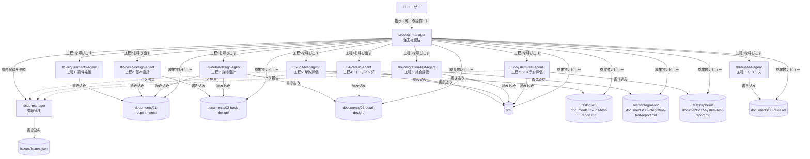
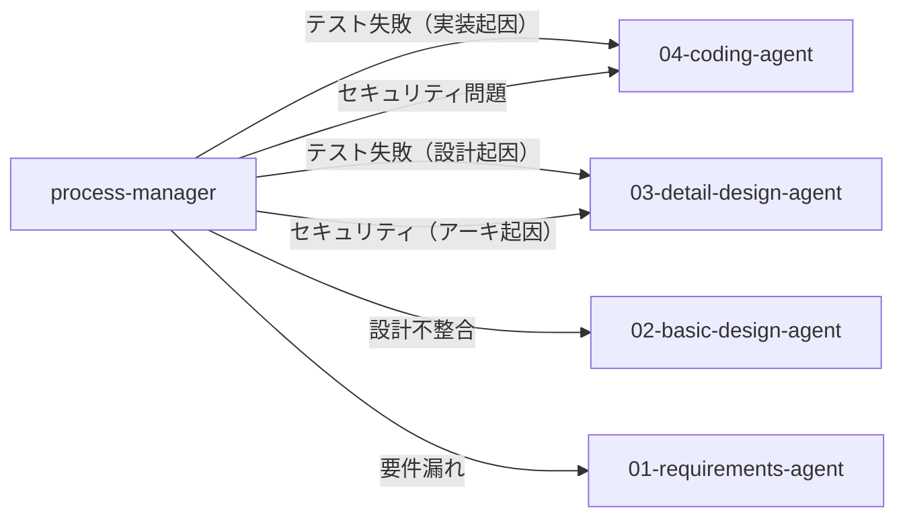

# Webシステム開発 — エージェント構成

## エージェント一覧

| エージェント | 種別 | 役割 | 成果物管理フォルダ |
|------------|------|------|-----------------|
| `process-manager` | **ユーザー向け（唯一）** | 全工程統括・レビュー・差し戻し判断 | `documents/progress.json` |
| `issue-manager` | サブエージェント | 課題・バグ・リスク登録管理 | `issues/` |
| `01-requirements-agent` | サブエージェント（工程1） | 要件定義 | `documents/01-requirements/` |
| `02-basic-design-agent` | サブエージェント（工程2） | 基本設計 | `documents/02-basic-design/` |
| `03-detail-design-agent` | サブエージェント（工程3） | 詳細設計 | `documents/03-detail-design/` |
| `04-coding-agent` | サブエージェント（工程4） | コーディング | `src/` |
| `05-unit-test-agent` | サブエージェント（工程5） | 単体評価 | `tests/unit/`, `documents/05-unit-test-report.md` |
| `06-integration-test-agent` | サブエージェント（工程6） | 結合評価 | `tests/integration/`, `documents/06-integration-test-report.md` |
| `07-system-test-agent` | サブエージェント（工程7） | システム評価 | `tests/system/`, `documents/07-system-test-report.md` |
| `08-release-agent` | サブエージェント（工程8） | リリース | `documents/08-release/` |

> **原則**: 各成果物フォルダは担当エージェントのみ書き込み可。他のエージェント・ユーザーは読み取り専用。

---

## 成果物オーナーシップ

| フォルダ / ファイル | オーナー（書き込み可） | 読み取り可 |
|--------------------|----------------------|-----------|
| `requests/` | ユーザー | 全エージェント |
| `documents/progress.json` | `process-manager` | 全エージェント |
| `documents/01-requirements/` | `01-requirements-agent` | 工程2以降 + process-manager |
| `documents/02-basic-design/` | `02-basic-design-agent` | 工程3以降 + process-manager |
| `documents/03-detail-design/` | `03-detail-design-agent` | 工程4以降 + process-manager |
| `src/` | `04-coding-agent` | 工程5以降 + process-manager |
| `tests/unit/` | `05-unit-test-agent` | 工程6以降 + process-manager |
| `tests/integration/` | `06-integration-test-agent` | 工程7以降 + process-manager |
| `tests/system/` | `07-system-test-agent` | `08-release-agent` + process-manager |
| `documents/05-unit-test-report.md` | `05-unit-test-agent` | 工程6以降 + process-manager |
| `documents/06-integration-test-report.md` | `06-integration-test-agent` | 工程7以降 + process-manager |
| `documents/07-system-test-report.md` | `07-system-test-agent` | `08-release-agent` + process-manager |
| `documents/08-release/` | `08-release-agent` | process-manager |
| `issues/issues.json` | `issue-manager` | 全エージェント |

---

## 連携フロー



---

## 差し戻しフロー



---

## ディレクトリ構成（参考）

```
websys/
├── agents.md               ← このファイル（エージェント構成）
├── requests/               ← ユーザーが置く要求仕様・議事録
├── documents/              ← 全設計書・テストレポート（エージェントが生成）
│   ├── progress.json       ← process-manager が管理
│   ├── 01-requirements/
│   ├── 02-basic-design/
│   ├── 03-detail-design/
│   ├── 05-unit-test-report.md
│   ├── 06-integration-test-report.md
│   ├── 07-system-test-report.md
│   └── 08-release/
├── src/                    ← 実装ソース（04-coding-agent が生成）
│   ├── system/
│   └── apps/
├── tests/
│   ├── unit/
│   ├── integration/
│   └── system/
├── issues/
│   └── issues.json         ← issue-manager が管理
└── .github/
    ├── agents/             ← エージェント定義
    ├── skills/             ← スキル（専門知識）
    └── prompts/            ← プロンプトテンプレート
```
