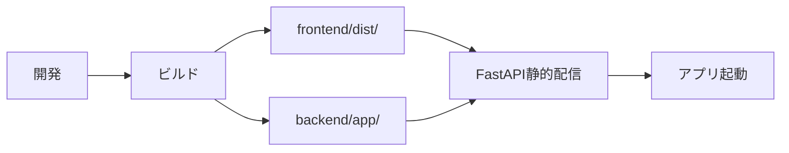

# アプリケーションアーキテクチャ設計書（TODOアプリ）

| 項目 | 内容 |
|------|------|
| 作成日 | 2026年5月28日 |
| バージョン | 1.0 |
| 対象 | TODOアプリ（app） |
| 工程 | 工程2: 基本設計 |

---

## 1. TODOアプリ概要

### 1.1 アプリケーション情報

| 項目 | 内容 |
|------|------|
| **アプリID** | `todo-app` |
| **アプリ名** | TODO管理 |
| **説明** | タスクの追加・編集・削除・完了管理を行うアプリケーション |
| **バージョン** | 1.0.0 |
| **作成者** | System Team |

### 1.2 機能概要

- TODO追加: タイトル・内容・期限を入力してTODOを作成
- TODO一覧表示: ユーザーのTODO一覧を表示
- TODO編集: 既存TODOの情報を変更
- TODO削除: TODOを削除
- TODO完了/未完了切り替え: 完了状態をトグル
- TODOフィルタ表示: 完了/未完了でフィルタ
- TODO検索: タイトル・内容で検索

---

## 2. アーキテクチャ構成

### 2.1 システム構成図

```
┌─────────────────────────────────────────────────────────────┐
│                      ブラウザ                                │
│  ┌───────────────────────────────────────────────────┐     │
│  │  TODOアプリ フロントエンド                         │     │
│  │  (TypeScript + Alpine.js + Bootstrap)             │     │
│  │  - TODOリスト表示                                  │     │
│  │  - TODO追加/編集フォーム                          │     │
│  │  - フィルタ・検索機能                              │     │
│  └───────────────────────────────────────────────────┘     │
│           │                                                  │
│           │ REST API (JSON)                                 │
│           │ JWT httpOnly Cookie（システム共通基盤経由）    │
└───────────┼──────────────────────────────────────────────────┘
            │
            ▼
┌─────────────────────────────────────────────────────────────┐
│              TODOアプリ バックエンド（FastAPI）              │
│  ┌───────────────────────────────────────────────────┐     │
│  │  API層                                             │     │
│  │  - TODO CRUD API (/api/todo-app/*)                │     │
│  │  - JWT検証（システム共通基盤の関数を利用）        │     │
│  └───────────────────────────────────────────────────┘     │
│  ┌───────────────────────────────────────────────────┐     │
│  │  ビジネスロジック層                                │     │
│  │  - TODO操作（作成・更新・削除）                    │     │
│  │  - ユーザー権限チェック                            │     │
│  └───────────────────────────────────────────────────┘     │
│  ┌───────────────────────────────────────────────────┐     │
│  │  DAL層（システム共通基盤を利用）                   │     │
│  │  - JSON DBアクセス                                 │     │
│  └───────────────────────────────────────────────────┘     │
└───────────┬─────────────────────────────────────────────────┘
            │
            ▼
┌─────────────────────────────────────────────────────────────┐
│              データ層（JSONファイル）                        │
│  - apps/todo-app/backend/data/todos.json                    │
└─────────────────────────────────────────────────────────────┘
```

### 2.2 システム共通基盤との連携

| 連携項目 | 連携方法 |
|---------|---------|
| **認証** | システム共通基盤の認証API（`/api/sys/auth/me`）を利用してユーザー情報を取得 |
| **JWT検証** | システム共通基盤の `get_current_user` 依存関係を利用 |
| **DAL** | システム共通基盤のDAL抽象クラスを継承し、TODOアプリのデータアクセスを実装 |
| **共通UI** | システム共通基盤のヘッダー・ナビゲーションを利用（`/apps/todo-app/index.html` に埋め込み） |
| **通知** | システム共通基盤の通知API（SSE）を利用して、TODO追加・完了時に通知を送信（オプション） |

---

## 3. データモデル設計

### 3.1 TODOデータ構造

**ファイル**: `apps/todo-app/backend/data/todos.json`

```json
{
  "todos": [
    {
      "id": "todo_001",
      "userId": "user_001",
      "title": "プロジェクト計画書を作成",
      "description": "工程2の基本設計書を作成する",
      "dueDate": "2026-06-01T00:00:00Z",
      "completed": false,
      "createdAt": "2026-05-28T10:00:00Z",
      "updatedAt": "2026-05-28T10:00:00Z"
    },
    {
      "id": "todo_002",
      "userId": "user_001",
      "title": "テストコード作成",
      "description": "単体テストを作成する",
      "dueDate": "2026-06-05T00:00:00Z",
      "completed": true,
      "createdAt": "2026-05-28T11:00:00Z",
      "updatedAt": "2026-05-28T12:00:00Z"
    }
  ]
}
```

### 3.2 フィールド定義

| フィールド | 型 | 必須 | 説明 |
|-----------|-----|------|------|
| `id` | string | ✓ | TODO ID（自動生成、`todo_XXX` 形式） |
| `userId` | string | ✓ | 所有者のユーザーID |
| `title` | string | ✓ | TODOタイトル（最大100文字） |
| `description` | string | − | TODO詳細説明（最大500文字） |
| `dueDate` | string | − | 期限（ISO 8601形式） |
| `completed` | boolean | ✓ | 完了状態（デフォルト: `false`） |
| `createdAt` | string | ✓ | 作成日時（ISO 8601形式） |
| `updatedAt` | string | ✓ | 更新日時（ISO 8601形式） |

---

## 4. レイヤー構成

### 4.1 レイヤー定義

| レイヤー | 責務 | 実装箇所 |
|---------|------|---------|
| **プレゼンテーション層** | UI表示・ユーザーインタラクション | `frontend/src/` （Alpine.js） |
| **API層** | RESTエンドポイント提供・リクエスト処理 | `backend/app/api/` （FastAPI） |
| **ビジネスロジック層** | TODO操作ロジック・権限チェック | `backend/app/services/` （Python） |
| **DAL層** | データアクセス抽象化 | `backend/app/dal/` （システム共通基盤のDALを利用） |
| **データ層** | データ永続化 | `backend/data/todos.json` |

### 4.2 依存関係

```
プレゼンテーション層
    ↓（REST API呼び出し）
API層
    ↓（サービス呼び出し）
ビジネスロジック層
    ↓（DAL呼び出し）
DAL層
    ↓（ファイル読み書き）
データ層
```

---

## 5. セキュリティ設計

### 5.1 認証・認可

| セキュリティ項目 | 実装方法 |
|---------------|---------|
| **認証** | システム共通基盤のJWT（httpOnly Cookie）を検証 |
| **ユーザー識別** | JWTトークンから `user_id` を取得し、TODO操作の権限チェック |
| **データ分離** | ユーザーは自分のTODOのみ参照・編集可能 |
| **XSS対策** | Alpine.jsの `x-text` を使用してエスケープ |
| **CSRF対策** | システム共通基盤のCookie（`SameSite=Strict`）に依存 |

### 5.2 アクセス制御

```python
# TODOアクセス権限チェック例
async def check_todo_access(todo_id: str, user_id: str) -> bool:
    todo = await dal.get("todos", todo_id)
    
    if not todo:
        raise HTTPException(status_code=404, detail="TODOが見つかりません")
    
    if todo['userId'] != user_id:
        raise HTTPException(status_code=403, detail="このTODOにアクセスする権限がありません")
    
    return True
```

---

## 6. 性能設計

### 6.1 レスポンスタイム目標

| API種別 | 目標値 | 備考 |
|---------|--------|------|
| TODO一覧取得 | 100ms以下 | 100件まで |
| TODO作成 | 150ms以下 | バリデーション含む |
| TODO更新 | 150ms以下 | バリデーション含む |
| TODO削除 | 100ms以下 | - |

### 6.2 データ量設計

| 項目 | 設計値 |
|------|--------|
| ユーザーあたりTODO上限 | 1,000件 |
| TODO一覧取得件数 | 100件/ページ |
| タイトル最大長 | 100文字 |
| 説明最大長 | 500文字 |

---

## 7. エラーハンドリング設計

### 7.1 エラーレスポンス形式

```json
{
  "error": {
    "code": "TODO_NOT_FOUND",
    "message": "TODOが見つかりません",
    "details": {
      "todoId": "todo_999"
    }
  }
}
```

### 7.2 エラーコード一覧

| コード | HTTPステータス | メッセージ |
|-------|--------------|-----------|
| `TODO_NOT_FOUND` | 404 | TODOが見つかりません |
| `TODO_ACCESS_DENIED` | 403 | このTODOにアクセスする権限がありません |
| `TODO_VALIDATION_ERROR` | 400 | 入力内容が不正です |
| `TODO_TITLE_REQUIRED` | 400 | タイトルは必須です |
| `TODO_TITLE_TOO_LONG` | 400 | タイトルは100文字以内である必要があります |
| `TODO_DESCRIPTION_TOO_LONG` | 400 | 説明は500文字以内である必要があります |

---

## 8. デプロイメント設計

### 8.1 ビルド・デプロイフロー



### 8.2 ビルドコマンド

```bash
# フロントエンドビルド
cd apps/todo-app/frontend
npm install
npm run build  # → dist/

# バックエンド起動（システム共通基盤と統合）
cd ../../../
uvicorn backend.app.sys.main:app --reload
```

### 8.3 静的ファイル配信

FastAPIのメインアプリケーション（`backend/app/sys/main.py`）で以下のように配信：

```python
app.mount("/apps/todo-app", StaticFiles(directory="apps/todo-app/frontend/dist"), name="todo-app")
```

---

## 9. 拡張性設計

### 9.1 将来の拡張機能

| 拡張機能 | 設計上の考慮 |
|---------|------------|
| **タグ機能** | TODOモデルに `tags: string[]` フィールドを追加 |
| **優先度設定** | TODOモデルに `priority: "high"\|"medium"\|"low"` フィールドを追加 |
| **カテゴリ分類** | TODOモデルに `category: string` フィールドを追加 |
| **共有機能** | TODOモデルに `sharedWith: string[]` フィールドを追加し、他ユーザーのアクセスを許可 |
| **通知機能** | TODO期限が近づいた際に、システム共通基盤の通知API（SSE）経由で通知 |

---

## 10. テスト戦略

### 10.1 テストレベル

| テストレベル | 対象 | 実施工程 |
|------------|------|---------|
| **単体テスト** | 各関数・コンポーネント | 工程5 |
| **結合テスト** | API ↔ DAL の連携 | 工程6 |
| **システムテスト** | フロント ↔ バックエンドの統合 | 工程7 |

### 10.2 テストカバレッジ目標

| レイヤー | カバレッジ目標 |
|---------|--------------|
| API層 | 80%以上 |
| ビジネスロジック層 | 90%以上 |
| DAL層 | 80%以上 |
| フロントエンド | 70%以上 |

---

## 関連ドキュメント

- [TODOアプリAPI設計書](./api-design.md)
- [TODOアプリ画面設計書](./screen-design.md)
- [TODOアプリmanifest.json](./manifest-schema.md)
- [TODOアプリディレクトリ構成](./directory-structure.md)
- [システム共通基盤アーキテクチャ](../../sys/02-basic-design/architecture.md)
- [工程1: 要件定義](../01-requirements/)
