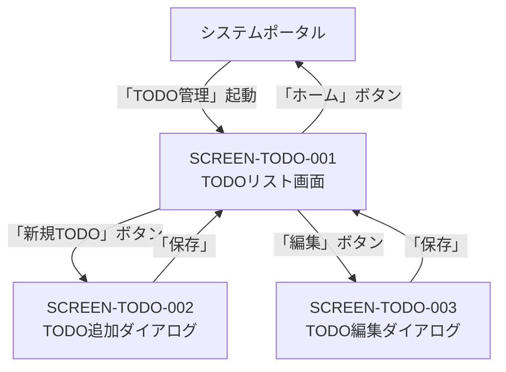

# 画面設計書（TODOアプリ）

| 項目 | 内容 |
|------|------|
| 作成日 | 2026年5月28日 |
| バージョン | 1.0 |
| 対象 | TODOアプリ（app） |
| 工程 | 工程2: 基本設計 |

---

## 1. 画面一覧

| 画面ID | 画面名 | URL | 権限 | 説明 |
|--------|-------|-----|------|------|
| SCREEN-TODO-001 | TODOリスト画面 | `/apps/todo-app/` | ログイン必須 | TODO一覧表示・フィルタ・検索 |
| SCREEN-TODO-002 | TODO追加ダイアログ | （モーダル） | ログイン必須 | 新規TODO作成 |
| SCREEN-TODO-003 | TODO編集ダイアログ | （モーダル） | ログイン必須 | 既存TODO編集 |

---

## 2. 画面遷移図



---

## 3. SCREEN-TODO-001: TODOリスト画面

### 3.1 ワイヤーフレーム

```
┌─────────────────────────────────────────────────────────────────┐
│ [ホーム] TODO管理                            [ユーザー名 ▼]     │
└─────────────────────────────────────────────────────────────────┘
│                                                                  │
│  TODOリスト                                    [+ 新規TODO]     │
│                                                                  │
│  統計: 合計 10件 | 完了 3件 | 未完了 7件 | 期限切れ 2件         │
│                                                                  │
│  ┌────────────────────────────────────────────────────────┐    │
│  │ フィルタ: [すべて ▼]  検索: [____________] [検索]     │    │
│  └────────────────────────────────────────────────────────┘    │
│                                                                  │
│  ┌────────────────────────────────────────────────────────┐    │
│  │ ☐ プロジェクト計画書を作成               期限: 6/1    │    │
│  │    工程2の基本設計書を作成する                         │    │
│  │    [編集] [削除] [完了にする]                          │    │
│  ├────────────────────────────────────────────────────────┤    │
│  │ ☑ テストコード作成                      期限: 6/5    │    │
│  │    単体テストを作成する                                │    │
│  │    [編集] [削除] [未完了に戻す]                        │    │
│  ├────────────────────────────────────────────────────────┤    │
│  │ ☐ デプロイ設定                          期限: なし   │    │
│  │    本番環境のデプロイ設定を行う                        │    │
│  │    [編集] [削除] [完了にする]                          │    │
│  └────────────────────────────────────────────────────────┘    │
│                                                                  │
└─────────────────────────────────────────────────────────────────┘
```

### 3.2 要素定義

| セクション | 要素 | タイプ | 説明 |
|-----------|------|--------|------|
| **ヘッダー** | ホームボタン | ボタン | システムポータルに戻る |
| | ユーザー名ドロップダウン | ドロップダウン | ログアウト・パスワード変更 |
| **統計情報** | 合計件数 | テキスト表示 | 総TODO数 |
| | 完了件数 | テキスト表示 | 完了済みTODO数 |
| | 未完了件数 | テキスト表示 | 未完了TODO数 |
| | 期限切れ件数 | テキスト表示 | 期限切れTODO数 |
| **操作** | 新規TODOボタン | ボタン | TODO追加ダイアログを開く |
| **フィルタ** | フィルタドロップダウン | ドロップダウン | すべて/未完了/完了でフィルタ |
| | 検索ボックス | テキスト入力 | タイトル・内容で検索 |
| | 検索ボタン | ボタン | 検索実行 |
| **TODOリスト** | チェックボックス | チェックボックス | 完了状態表示 |
| | タイトル | テキスト表示 | TODOタイトル |
| | 説明 | テキスト表示 | TODO説明 |
| | 期限 | テキスト表示 | 期限日（期限切れは赤文字） |
| | 編集ボタン | ボタン | TODO編集ダイアログを開く |
| | 削除ボタン | ボタン | TODO削除確認ダイアログを開く |
| | 完了ボタン | ボタン | TODO完了/未完了を切り替え |

### 3.3 画面動作

1. **初期表示**
   - `GET /api/todo-app/todos` でTODO一覧取得
   - `GET /api/todo-app/todos/stats` で統計情報取得
   - TODOリストを表示

2. **フィルタ適用**
   - フィルタドロップダウンで「未完了」「完了」を選択
   - `GET /api/todo-app/todos?completed=false` でフィルタ済みデータ取得
   - リストを再表示

3. **検索**
   - 検索ボックスにキーワードを入力
   - 検索ボタンをクリック
   - `GET /api/todo-app/todos?search=<keyword>` で検索結果取得
   - リストを再表示

4. **TODO完了/未完了切り替え**
   - チェックボックスまたは「完了にする」ボタンをクリック
   - `PATCH /api/todo-app/todos/{todo_id}/toggle` を呼び出し
   - リストを再読み込み
   - 成功メッセージ表示（トースト通知）

5. **TODO削除**
   - 「削除」ボタンをクリック
   - 確認ダイアログ表示
   - 確認後、`DELETE /api/todo-app/todos/{todo_id}` を呼び出し
   - リストを再読み込み
   - 成功メッセージ表示

6. **TODO編集**
   - 「編集」ボタンをクリック
   - TODO編集ダイアログを開く

7. **新規TODO**
   - 「新規TODO」ボタンをクリック
   - TODO追加ダイアログを開く

### 3.4 Alpine.js実装例

```html
<div x-data="todoListPage()" x-init="init">
  <!-- 統計情報 -->
  <div class="card mb-3">
    <div class="card-body">
      <p>統計: 合計 <span x-text="stats.total"></span>件 | 完了 <span x-text="stats.completed"></span>件 | 未完了 <span x-text="stats.pending"></span>件 | 期限切れ <span x-text="stats.overdue"></span>件</p>
    </div>
  </div>
  
  <!-- フィルタ・検索 -->
  <div class="card mb-3">
    <div class="card-body">
      <div class="row">
        <div class="col-md-4">
          <select class="form-select" x-model="filter" @change="loadTodos">
            <option value="">すべて</option>
            <option value="false">未完了</option>
            <option value="true">完了</option>
          </select>
        </div>
        <div class="col-md-6">
          <input type="text" class="form-control" placeholder="検索..." x-model="search" @keyup.enter="loadTodos">
        </div>
        <div class="col-md-2">
          <button class="btn btn-primary w-100" @click="loadTodos">検索</button>
        </div>
      </div>
    </div>
  </div>
  
  <!-- TODOリスト -->
  <div class="d-flex justify-content-between mb-3">
    <h4>TODOリスト</h4>
    <button class="btn btn-success" @click="openAddDialog">+ 新規TODO</button>
  </div>
  
  <div class="list-group">
    <template x-for="todo in todos" :key="todo.id">
      <div class="list-group-item">
        <div class="d-flex align-items-start">
          <input 
            type="checkbox" 
            class="form-check-input me-3" 
            :checked="todo.completed" 
            @change="toggleTodo(todo.id)"
          >
          <div class="flex-grow-1">
            <h5 :class="{'text-decoration-line-through': todo.completed}" x-text="todo.title"></h5>
            <p class="text-muted" x-text="todo.description"></p>
            <small :class="{'text-danger': isOverdue(todo.dueDate)}">
              期限: <span x-text="formatDate(todo.dueDate) || 'なし'"></span>
            </small>
          </div>
          <div class="btn-group">
            <button class="btn btn-sm btn-outline-primary" @click="openEditDialog(todo)">編集</button>
            <button class="btn btn-sm btn-outline-danger" @click="deleteTodo(todo.id)">削除</button>
            <button 
              class="btn btn-sm btn-outline-success" 
              @click="toggleTodo(todo.id)"
              x-text="todo.completed ? '未完了に戻す' : '完了にする'"
            ></button>
          </div>
        </div>
      </div>
    </template>
  </div>
</div>

<script>
function todoListPage() {
  return {
    todos: [],
    stats: {},
    filter: '',
    search: '',
    
    async init() {
      await this.loadTodos();
      await this.loadStats();
    },
    
    async loadTodos() {
      const params = new URLSearchParams();
      if (this.filter) params.append('completed', this.filter);
      if (this.search) params.append('search', this.search);
      
      const response = await fetch(`/api/todo-app/todos?${params}`);
      const data = await response.json();
      this.todos = data.todos;
    },
    
    async loadStats() {
      const response = await fetch('/api/todo-app/todos/stats');
      this.stats = await response.json();
    },
    
    async toggleTodo(todoId) {
      await fetch(`/api/todo-app/todos/${todoId}/toggle`, { method: 'PATCH' });
      await this.loadTodos();
      await this.loadStats();
      showToast('TODOの状態を更新しました', 'success');
    },
    
    async deleteTodo(todoId) {
      if (!confirm('本当にこのTODOを削除しますか?')) return;
      
      await fetch(`/api/todo-app/todos/${todoId}`, { method: 'DELETE' });
      await this.loadTodos();
      await this.loadStats();
      showToast('TODOを削除しました', 'success');
    },
    
    openAddDialog() {
      // TODO追加ダイアログを開く（別のAlpineコンポーネント）
      window.dispatchEvent(new CustomEvent('open-todo-add-dialog'));
    },
    
    openEditDialog(todo) {
      // TODO編集ダイアログを開く（別のAlpineコンポーネント）
      window.dispatchEvent(new CustomEvent('open-todo-edit-dialog', { detail: todo }));
    },
    
    formatDate(dateStr) {
      if (!dateStr) return '';
      return new Date(dateStr).toLocaleDateString('ja-JP');
    },
    
    isOverdue(dateStr) {
      if (!dateStr) return false;
      return new Date(dateStr) < new Date();
    }
  };
}
</script>
```

---

## 4. SCREEN-TODO-002: TODO追加ダイアログ

### 4.1 ワイヤーフレーム

```
┌─────────────────────────────────────────────┐
│ TODO追加                        [×]         │
├─────────────────────────────────────────────┤
│                                              │
│  タイトル（必須）                            │
│  [_____________________]                     │
│                                              │
│  説明                                        │
│  [_____________________]                     │
│  [_____________________]                     │
│  [_____________________]                     │
│                                              │
│  期限                                        │
│  [____/____/____]  📅                       │
│                                              │
│               [キャンセル]  [保存]           │
│                                              │
└─────────────────────────────────────────────┘
```

### 4.2 要素定義

| 要素 | タイプ | 説明 | バリデーション |
|------|--------|------|--------------|
| タイトル | テキスト入力 | TODOタイトル | 必須、100文字以内 |
| 説明 | テキストエリア | TODO説明 | 500文字以内 |
| 期限 | 日付入力 | 期限日 | 日付形式 |
| 保存ボタン | ボタン | TODO作成実行 | - |
| キャンセルボタン | ボタン | ダイアログを閉じる | - |

### 4.3 画面動作

1. **初期表示**
   - 全フィールドを空欄で表示

2. **バリデーション**
   - タイトル必須チェック
   - タイトル長チェック（100文字以内）
   - 説明長チェック（500文字以内）

3. **保存処理**
   - 「保存」ボタンをクリック
   - `POST /api/todo-app/todos` を呼び出し
   - 成功時: ダイアログを閉じ、リストを再読み込み、成功メッセージ表示
   - 失敗時: エラーメッセージ表示

---

## 5. SCREEN-TODO-003: TODO編集ダイアログ

### 5.1 ワイヤーフレーム

```
┌─────────────────────────────────────────────┐
│ TODO編集                        [×]         │
├─────────────────────────────────────────────┤
│                                              │
│  タイトル（必須）                            │
│  [プロジェクト計画書を作成]                  │
│                                              │
│  説明                                        │
│  [工程2の基本設計書を作成する]              │
│  [_____________________]                     │
│  [_____________________]                     │
│                                              │
│  期限                                        │
│  [2026/06/01]  📅                           │
│                                              │
│  ☐ 完了                                     │
│                                              │
│               [キャンセル]  [保存]           │
│                                              │
└─────────────────────────────────────────────┘
```

### 5.2 要素定義

| 要素 | タイプ | 説明 | バリデーション |
|------|--------|------|--------------|
| タイトル | テキスト入力 | TODOタイトル | 必須、100文字以内 |
| 説明 | テキストエリア | TODO説明 | 500文字以内 |
| 期限 | 日付入力 | 期限日 | 日付形式 |
| 完了チェックボックス | チェックボックス | 完了状態 | - |
| 保存ボタン | ボタン | TODO更新実行 | - |
| キャンセルボタン | ボタン | ダイアログを閉じる | - |

### 5.3 画面動作

1. **初期表示**
   - 既存TODOの情報をフィールドに設定

2. **バリデーション**
   - タイトル必須チェック
   - タイトル長チェック（100文字以内）
   - 説明長チェック（500文字以内）

3. **保存処理**
   - 「保存」ボタンをクリック
   - `PUT /api/todo-app/todos/{todo_id}` を呼び出し
   - 成功時: ダイアログを閉じ、リストを再読み込み、成功メッセージ表示
   - 失敗時: エラーメッセージ表示

---

## 6. 共通UIコンポーネント

### 6.1 トースト通知

```
┌─────────────────────────────────────────┐
│ ✓ TODOを作成しました            [×]    │
└─────────────────────────────────────────┘
```

**用途**: 成功・エラーメッセージの表示

**タイプ**:
- `success`: 緑背景、チェックアイコン
- `error`: 赤背景、エラーアイコン

**表示位置**: 画面右上

**表示時間**: 3秒間自動消去

### 6.2 確認ダイアログ

```
┌─────────────────────────────────────────┐
│ 確認                        [×]         │
├─────────────────────────────────────────┤
│                                          │
│  本当にこのTODOを削除しますか？          │
│                                          │
│           [キャンセル]  [削除]           │
│                                          │
└─────────────────────────────────────────┘
```

**用途**: 削除確認

---

## 7. レスポンシブデザイン

### 7.1 スマートフォン表示（横幅 < 768px）

- TODOリストの操作ボタンを縦並びに変更
- フィルタ・検索を縦並びに変更
- ダイアログを全画面表示

---

## 関連ドキュメント

- [TODOアプリアーキテクチャ設計書](./architecture.md)
- [TODOアプリAPI設計書](./api-design.md)
- [TODOアプリmanifest.json](./manifest-schema.md)
- [システム共通基盤画面設計書](../../sys/02-basic-design/screen-design.md)
- [工程1: 要件定義](../01-requirements/)
