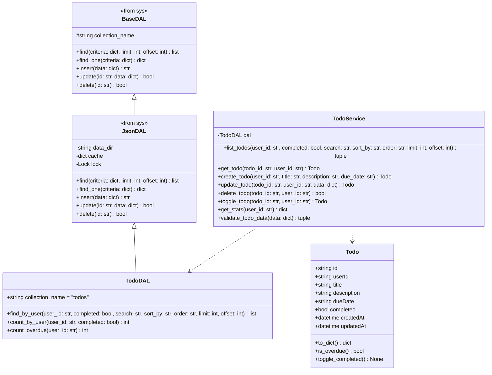

# クラス設計書（TODOアプリ）

| 項目 | 内容 |
|------|------|
| 作成日 | 2026年5月28日 |
| バージョン | 1.0 |
| 対象 | TODOアプリ（app） |
| 工程 | 工程3: 詳細設計 |

---

## 1. クラス図（全体構成）



---

## 2. エンティティクラス詳細

### 2.1 Todo クラス

**責務**: TODO情報を表すエンティティ

**ファイル**: `apps/todo-app/backend/app/models/todo.py`

**属性**:

| 属性名 | 型 | 説明 |
|--------|-----|------|
| `id` | str | TODO ID（UUID） |
| `userId` | str | 所有ユーザーID |
| `title` | str | タイトル |
| `description` | str | 内容 |
| `dueDate` | str | 期限（ISO8601） |
| `completed` | bool | 完了フラグ |
| `createdAt` | datetime | 作成日時 |
| `updatedAt` | datetime | 更新日時 |

**メソッド**:

| メソッド名 | 引数 | 戻り値 | 説明 |
|-----------|------|--------|------|
| `to_dict` | なし | `dict` | 辞書形式に変換 |
| `is_overdue` | なし | `bool` | 期限切れか判定（未完了 && 期限 < 現在日時） |
| `toggle_completed` | なし | `None` | 完了状態を反転 |
| `from_dict` | `data: dict` | `Todo` | 辞書からインスタンスを生成（クラスメソッド） |

**実装例**:

```python
from datetime import datetime
from pydantic import BaseModel

class Todo(BaseModel):
    id: str
    userId: str
    title: str
    description: str = ""
    dueDate: str | None = None
    completed: bool = False
    createdAt: datetime
    updatedAt: datetime

    def to_dict(self) -> dict:
        """辞書形式に変換"""
        return self.model_dump()

    def is_overdue(self) -> bool:
        """期限切れか判定"""
        if self.completed or not self.dueDate:
            return False
        due_date = datetime.fromisoformat(self.dueDate.replace("Z", "+00:00"))
        return due_date < datetime.utcnow()

    def toggle_completed(self) -> None:
        """完了状態を反転"""
        self.completed = not self.completed
        self.updatedAt = datetime.utcnow()

    @classmethod
    def from_dict(cls, data: dict) -> 'Todo':
        """辞書からインスタンスを生成"""
        return cls(**data)
```

---

## 3. サービス層クラス詳細

### 3.1 TodoService クラス

**責務**: TODOビジネスロジック

**ファイル**: `apps/todo-app/backend/app/services/todo_service.py`

**属性**:

| 属性名 | 型 | 説明 |
|--------|-----|------|
| `dal` | TodoDAL | TODO DAL |

**メソッド**:

| メソッド名 | 引数 | 戻り値 | 説明 |
|-----------|------|--------|------|
| `list_todos` | `user_id: str, completed: bool, search: str, sort_by: str, order: str, limit: int, offset: int` | `tuple[list[Todo], int]` | TODO一覧を取得（総数も返す） |
| `get_todo` | `todo_id: str, user_id: str` | `Todo` | TODO詳細を取得（権限チェック） |
| `create_todo` | `user_id: str, title: str, description: str, due_date: str` | `Todo` | TODOを作成 |
| `update_todo` | `todo_id: str, user_id: str, data: dict` | `Todo` | TODOを更新（権限チェック） |
| `delete_todo` | `todo_id: str, user_id: str` | `bool` | TODOを削除（権限チェック） |
| `toggle_todo` | `todo_id: str, user_id: str` | `Todo` | TODO完了/未完了を切り替え |
| `get_stats` | `user_id: str` | `dict` | TODO統計情報を取得 |
| `validate_todo_data` | `data: dict` | `tuple[bool, str]` | TODOデータをバリデーション |

**実装例**:

```python
from apps.todo_app.backend.app.dal.todo_dal import TodoDAL
from apps.todo_app.backend.app.models.todo import Todo
from fastapi import HTTPException, status
from datetime import datetime
import uuid

class TodoService:
    def __init__(self, dal: TodoDAL):
        self.dal = dal

    def list_todos(
        self,
        user_id: str,
        completed: bool | None = None,
        search: str | None = None,
        sort_by: str = "createdAt",
        order: str = "desc",
        limit: int = 100,
        offset: int = 0
    ) -> tuple[list[Todo], int]:
        """TODO一覧を取得"""
        todos_data = self.dal.find_by_user(
            user_id=user_id,
            completed=completed,
            search=search,
            sort_by=sort_by,
            order=order,
            limit=limit,
            offset=offset
        )
        todos = [Todo.from_dict(t) for t in todos_data]
        total = self.dal.count_by_user(user_id, completed)
        return todos, total

    def get_todo(self, todo_id: str, user_id: str) -> Todo:
        """TODO詳細を取得（権限チェック）"""
        todo_data = self.dal.find_one({"id": todo_id})
        if not todo_data:
            raise HTTPException(
                status_code=status.HTTP_404_NOT_FOUND,
                detail="ERR-TODO-001"
            )
        
        # 権限チェック
        if todo_data["userId"] != user_id:
            raise HTTPException(
                status_code=status.HTTP_403_FORBIDDEN,
                detail="ERR-TODO-002"
            )
        
        return Todo.from_dict(todo_data)

    def create_todo(
        self,
        user_id: str,
        title: str,
        description: str = "",
        due_date: str | None = None
    ) -> Todo:
        """TODOを作成"""
        # バリデーション
        is_valid, error_message = self.validate_todo_data({
            "title": title,
            "description": description,
            "dueDate": due_date
        })
        if not is_valid:
            raise HTTPException(
                status_code=status.HTTP_400_BAD_REQUEST,
                detail=error_message
            )
        
        todo = Todo(
            id=str(uuid.uuid4()),
            userId=user_id,
            title=title,
            description=description,
            dueDate=due_date,
            completed=False,
            createdAt=datetime.utcnow(),
            updatedAt=datetime.utcnow()
        )
        self.dal.insert(todo.to_dict())
        return todo

    def update_todo(self, todo_id: str, user_id: str, data: dict) -> Todo:
        """TODOを更新（権限チェック）"""
        # 既存TODO取得（権限チェック含む）
        todo = self.get_todo(todo_id, user_id)
        
        # バリデーション
        is_valid, error_message = self.validate_todo_data(data)
        if not is_valid:
            raise HTTPException(
                status_code=status.HTTP_400_BAD_REQUEST,
                detail=error_message
            )
        
        # 更新
        data["updatedAt"] = datetime.utcnow().isoformat()
        self.dal.update(todo_id, data)
        
        # 更新後のTODOを返す
        return self.get_todo(todo_id, user_id)

    def delete_todo(self, todo_id: str, user_id: str) -> bool:
        """TODOを削除（権限チェック）"""
        # 権限チェック
        self.get_todo(todo_id, user_id)
        return self.dal.delete(todo_id)

    def toggle_todo(self, todo_id: str, user_id: str) -> Todo:
        """TODO完了/未完了を切り替え"""
        todo = self.get_todo(todo_id, user_id)
        todo.toggle_completed()
        self.dal.update(todo_id, {
            "completed": todo.completed,
            "updatedAt": datetime.utcnow().isoformat()
        })
        return todo

    def get_stats(self, user_id: str) -> dict:
        """TODO統計情報を取得"""
        total = self.dal.count_by_user(user_id, None)
        completed = self.dal.count_by_user(user_id, True)
        pending = self.dal.count_by_user(user_id, False)
        overdue = self.dal.count_overdue(user_id)
        
        return {
            "total": total,
            "completed": completed,
            "pending": pending,
            "overdue": overdue
        }

    def validate_todo_data(self, data: dict) -> tuple[bool, str]:
        """TODOデータをバリデーション"""
        # タイトルチェック
        title = data.get("title", "")
        if "title" in data:
            if not title or title.strip() == "":
                return False, "ERR-TODO-003"
            if len(title) > 100:
                return False, "ERR-TODO-004"
        
        # 説明チェック
        description = data.get("description", "")
        if description and len(description) > 500:
            return False, "ERR-TODO-005"
        
        # 期限チェック
        due_date = data.get("dueDate")
        if due_date:
            try:
                datetime.fromisoformat(due_date.replace("Z", "+00:00"))
            except (ValueError, AttributeError):
                return False, "ERR-TODO-006"
        
        return True, ""
```

---

## 4. DAL層クラス詳細

### 4.1 TodoDAL クラス

**責務**: TODOデータアクセス

**ファイル**: `apps/todo-app/backend/app/dal/todo_dal.py`

**属性**:

| 属性名 | 型 | 説明 |
|--------|-----|------|
| `collection_name` | str | `"todos"` |

**メソッド**（継承メソッド + 追加メソッド）:

| メソッド名 | 引数 | 戻り値 | 説明 |
|-----------|------|--------|------|
| `find_by_user` | `user_id: str, completed: bool, search: str, sort_by: str, order: str, limit: int, offset: int` | `list[dict]` | ユーザーのTODO一覧を取得（フィルタ・ソート対応） |
| `count_by_user` | `user_id: str, completed: bool` | `int` | ユーザーのTODO数をカウント |
| `count_overdue` | `user_id: str` | `int` | ユーザーの期限切れTODO数をカウント |

**実装例**:

```python
from backend.app.sys.dal.json_dal import JsonDAL
from datetime import datetime

class TodoDAL(JsonDAL):
    """TODO DAL"""
    
    collection_name = "todos"

    def find_by_user(
        self,
        user_id: str,
        completed: bool | None = None,
        search: str | None = None,
        sort_by: str = "createdAt",
        order: str = "desc",
        limit: int = 100,
        offset: int = 0
    ) -> list[dict]:
        """ユーザーのTODO一覧を取得（フィルタ・ソート対応）"""
        all_data = self._load_data()
        results = []
        
        for todo in all_data.values():
            # ユーザーIDフィルタ
            if todo["userId"] != user_id:
                continue
            
            # 完了状態フィルタ
            if completed is not None and todo["completed"] != completed:
                continue
            
            # 検索フィルタ
            if search:
                search_lower = search.lower()
                if search_lower not in todo["title"].lower() and search_lower not in todo["description"].lower():
                    continue
            
            results.append(todo)
        
        # ソート
        reverse = (order == "desc")
        results.sort(key=lambda t: t.get(sort_by, ""), reverse=reverse)
        
        # ページネーション
        return results[offset:offset + limit]

    def count_by_user(self, user_id: str, completed: bool | None = None) -> int:
        """ユーザーのTODO数をカウント"""
        criteria = {"userId": user_id}
        if completed is not None:
            criteria["completed"] = completed
        return self.count(criteria)

    def count_overdue(self, user_id: str) -> int:
        """ユーザーの期限切れTODO数をカウント"""
        all_data = self._load_data()
        now = datetime.utcnow().isoformat()
        count = 0
        
        for todo in all_data.values():
            if todo["userId"] != user_id:
                continue
            if todo["completed"]:
                continue
            if not todo.get("dueDate"):
                continue
            if todo["dueDate"] < now:
                count += 1
        
        return count
```

---

## 5. FastAPI APIエンドポイント

### 5.1 API実装例

**ファイル**: `apps/todo-app/backend/app/api/todos.py`

```python
from fastapi import APIRouter, Depends, HTTPException
from backend.app.sys.core.dependencies import get_current_user
from backend.app.sys.models.user import User
from apps.todo_app.backend.app.models.todo import Todo
from apps.todo_app.backend.app.services.todo_service import TodoService
from apps.todo_app.backend.app.dal.todo_dal import TodoDAL
from pydantic import BaseModel

router = APIRouter(prefix="/api/todo-app/todos", tags=["todo"])

# DTOモデル
class TodoCreate(BaseModel):
    title: str
    description: str = ""
    dueDate: str | None = None

class TodoUpdate(BaseModel):
    title: str | None = None
    description: str | None = None
    dueDate: str | None = None
    completed: bool | None = None

# 依存関係
def get_todo_service() -> TodoService:
    dal = TodoDAL("apps/todo-app/backend/data")
    return TodoService(dal)

@router.get("/")
async def list_todos(
    completed: bool | None = None,
    search: str | None = None,
    sortBy: str = "createdAt",
    order: str = "desc",
    limit: int = 100,
    offset: int = 0,
    user: User = Depends(get_current_user),
    service: TodoService = Depends(get_todo_service)
):
    """TODO一覧取得"""
    todos, total = service.list_todos(
        user_id=user.id,
        completed=completed,
        search=search,
        sort_by=sortBy,
        order=order,
        limit=limit,
        offset=offset
    )
    return {
        "todos": [todo.to_dict() for todo in todos],
        "total": total,
        "limit": limit,
        "offset": offset
    }

@router.get("/{todo_id}")
async def get_todo(
    todo_id: str,
    user: User = Depends(get_current_user),
    service: TodoService = Depends(get_todo_service)
):
    """TODO詳細取得"""
    todo = service.get_todo(todo_id, user.id)
    return todo.to_dict()

@router.post("/", status_code=201)
async def create_todo(
    data: TodoCreate,
    user: User = Depends(get_current_user),
    service: TodoService = Depends(get_todo_service)
):
    """TODO作成"""
    todo = service.create_todo(
        user_id=user.id,
        title=data.title,
        description=data.description,
        due_date=data.dueDate
    )
    return todo.to_dict()

@router.put("/{todo_id}")
async def update_todo(
    todo_id: str,
    data: TodoUpdate,
    user: User = Depends(get_current_user),
    service: TodoService = Depends(get_todo_service)
):
    """TODO更新"""
    todo = service.update_todo(todo_id, user.id, data.model_dump(exclude_unset=True))
    return todo.to_dict()

@router.delete("/{todo_id}")
async def delete_todo(
    todo_id: str,
    user: User = Depends(get_current_user),
    service: TodoService = Depends(get_todo_service)
):
    """TODO削除"""
    service.delete_todo(todo_id, user.id)
    return {"success": True, "message": "TODOを削除しました"}

@router.patch("/{todo_id}/toggle")
async def toggle_todo(
    todo_id: str,
    user: User = Depends(get_current_user),
    service: TodoService = Depends(get_todo_service)
):
    """TODO完了/未完了切り替え"""
    todo = service.toggle_todo(todo_id, user.id)
    return todo.to_dict()

@router.get("/stats", response_model=dict)
async def get_stats(
    user: User = Depends(get_current_user),
    service: TodoService = Depends(get_todo_service)
):
    """TODO統計情報取得"""
    return service.get_stats(user.id)
```

---

## 6. クラス設計の設計原則

### 6.1 SOLID原則適用

| 原則 | 説明 | 適用例 |
|------|------|--------|
| **単一責任の原則（SRP）** | 1クラス1責務 | `TodoService`はビジネスロジックのみ、`TodoDAL`はデータアクセスのみ |
| **開放閉鎖の原則（OCP）** | 拡張に開き、修正に閉じる | システム共通基盤の`BaseDAL`を継承して機能追加 |
| **リスコフの置換原則（LSP）** | 派生クラスは基底クラスと置き換え可能 | `TodoDAL`は`JsonDAL`のインターフェースを完全実装 |
| **インターフェース分離の原則（ISP）** | 必要なインターフェースのみ実装 | DALは必要最小限のメソッドのみ追加 |
| **依存性逆転の原則（DIP）** | 抽象に依存、具象に依存しない | `TodoService`は`TodoDAL`に依存（具象実装には依存しない） |

### 6.2 システム共通基盤との連携

| 連携項目 | 連携方法 |
|---------|---------|
| **認証** | `get_current_user` 依存関係を使用してJWT検証 |
| **DAL** | `JsonDAL` を継承して `TodoDAL` を実装 |
| **エラーハンドリング** | システム共通基盤のエラーコード体系を準拠 |
| **ログ出力** | システム共通基盤のログ設定を使用 |

---

## 7. まとめ

### 7.1 主要クラス一覧

| レイヤー | クラス名 | 責務 |
|---------|---------|------|
| エンティティ | `Todo` | TODOデータ構造定義 |
| サービス | `TodoService` | TODOビジネスロジック |
| DAL | `TodoDAL` | TODOデータアクセス |
| API | `todos.py` | FastAPI エンドポイント |

### 7.2 次工程への引き継ぎ

- 工程4（コーディング）では、このクラス設計に基づいて実装を行う
- システム共通基盤の `JsonDAL` を継承して `TodoDAL` を実装
- FastAPIの `Depends` で依存性注入
- エラーハンドリングは `error-handling.md` を参照

---

**トレーサビリティ**: この設計書は工程2の基本設計書（architecture.md, api-design.md）に基づいています。
