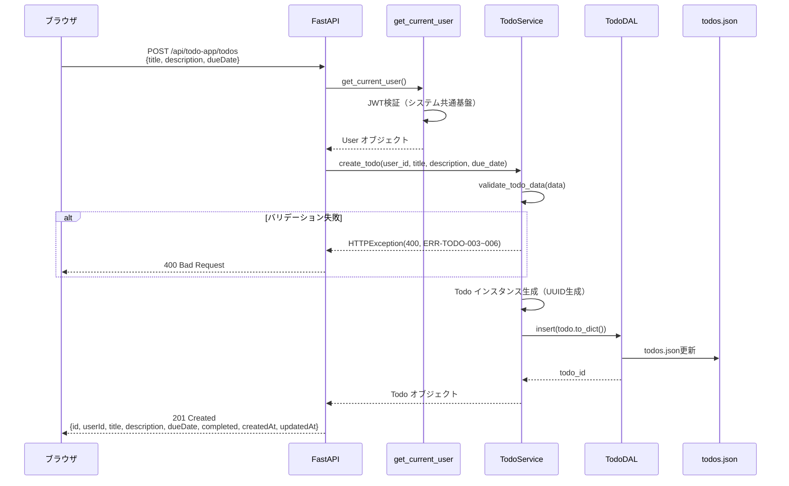
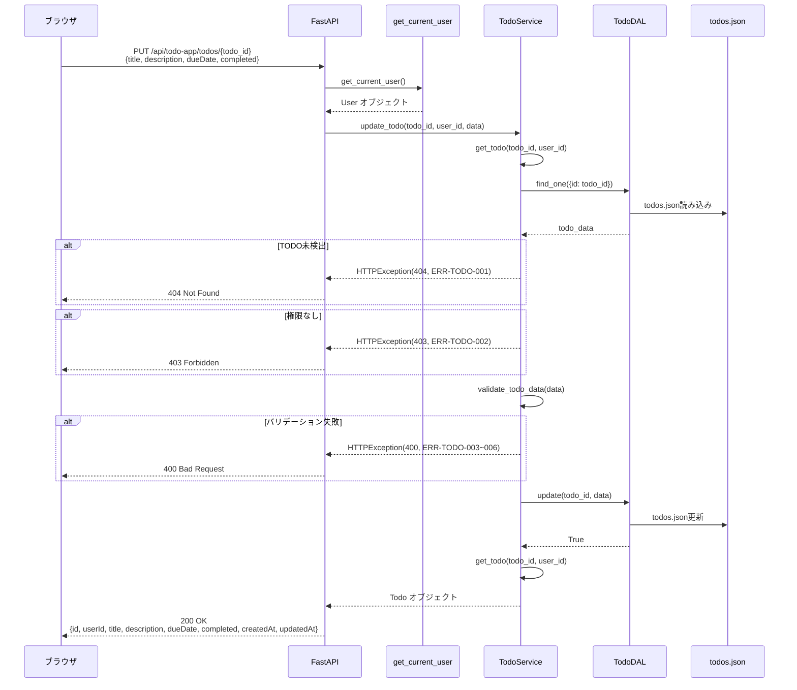
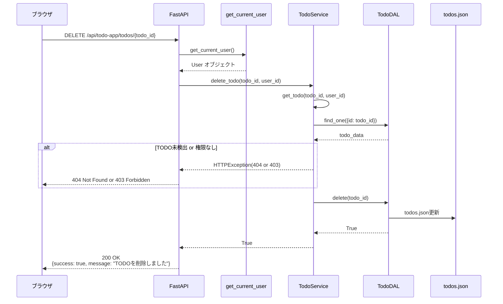
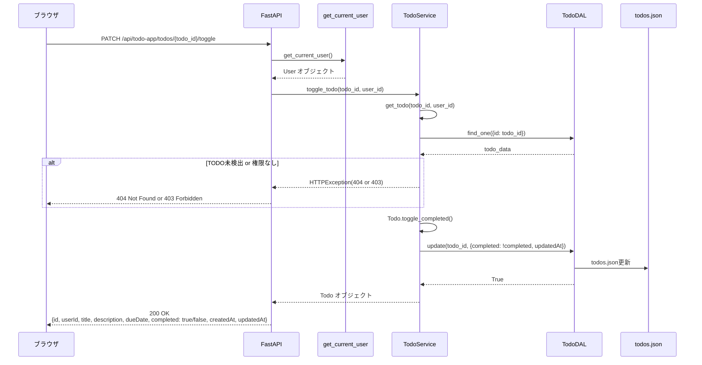
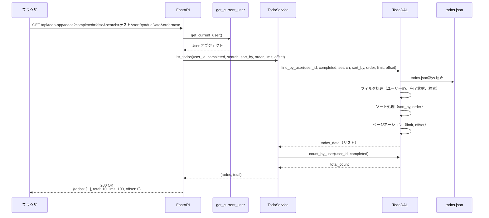
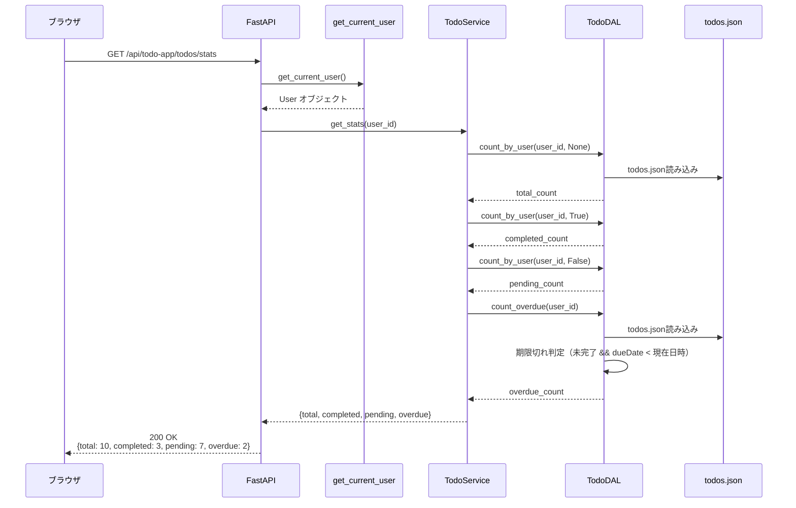

# シーケンス図（TODOアプリ）

| 項目 | 内容 |
|------|------|
| 作成日 | 2026年5月28日 |
| バージョン | 1.0 |
| 対象 | TODOアプリ（app） |
| 工程 | 工程3: 詳細設計 |

---

## 1. TODO追加フロー



**詳細説明**:
1. ブラウザが `/api/todo-app/todos` にPOSTリクエスト
2. `get_current_user` でJWT検証（システム共通基盤）
3. `TodoService.create_todo()` を呼び出し
4. `validate_todo_data()` でバリデーション
   - タイトル必須チェック（1〜100文字）
   - 説明文字数チェック（0〜500文字）
   - 期限ISO8601形式チェック
5. `Todo` インスタンス生成（UUID自動生成）
6. `TodoDAL.insert()` でTODOを保存
7. 作成されたTODO情報を返却

---

## 2. TODO更新フロー



**詳細説明**:
1. ブラウザが `/api/todo-app/todos/{todo_id}` にPUTリクエスト
2. `get_current_user` でJWT検証
3. `TodoService.update_todo()` を呼び出し
4. `get_todo()` でTODO取得と権限チェック
   - TODO存在確認（404エラー）
   - ユーザー所有確認（403エラー）
5. `validate_todo_data()` でバリデーション
6. `TodoDAL.update()` でTODOを更新
7. 更新後のTODO情報を返却

---

## 3. TODO削除フロー



**詳細説明**:
1. ブラウザが `/api/todo-app/todos/{todo_id}` にDELETEリクエスト
2. `get_current_user` でJWT検証
3. `TodoService.delete_todo()` を呼び出し
4. `get_todo()` で権限チェック（存在確認 + 所有確認）
5. `TodoDAL.delete()` でTODOを削除
6. 削除成功レスポンスを返却

---

## 4. TODO完了/未完了切り替えフロー



**詳細説明**:
1. ブラウザが `/api/todo-app/todos/{todo_id}/toggle` にPATCHリクエスト
2. `get_current_user` でJWT検証
3. `TodoService.toggle_todo()` を呼び出し
4. `get_todo()` で権限チェック
5. `Todo.toggle_completed()` で完了状態を反転
6. `TodoDAL.update()` で更新
7. 更新後のTODO情報を返却

---

## 5. TODO一覧取得フロー（フィルタ・検索含む）



**詳細説明**:
1. ブラウザが `/api/todo-app/todos` にGETリクエスト（クエリパラメータ付き）
2. `get_current_user` でJWT検証
3. `TodoService.list_todos()` を呼び出し
4. `TodoDAL.find_by_user()` でTODO一覧を取得
   - **ユーザーIDフィルタ**: `userId == user_id`
   - **完了状態フィルタ**: `completed == True/False`（指定時のみ）
   - **検索フィルタ**: `title` or `description` に検索文字列を含む
   - **ソート**: `sort_by` フィールドで昇順/降順ソート
   - **ページネーション**: `offset` 〜 `offset + limit` の範囲を返す
5. `TodoDAL.count_by_user()` で総数を取得
6. TODO一覧と総数を返却

---

## 6. TODO統計情報取得フロー



**詳細説明**:
1. ブラウザが `/api/todo-app/todos/stats` にGETリクエスト
2. `get_current_user` でJWT検証
3. `TodoService.get_stats()` を呼び出し
4. 以下の統計情報を取得：
   - **total**: 総TODO数（`count_by_user(user_id, None)`）
   - **completed**: 完了TODO数（`count_by_user(user_id, True)`）
   - **pending**: 未完了TODO数（`count_by_user(user_id, False)`）
   - **overdue**: 期限切れTODO数（`count_overdue(user_id)`）
5. 統計情報を返却

---

## 7. TODO期限切れ判定ロジック

**期限切れ条件**:
- `completed == False`（未完了）
- `dueDate != None`（期限が設定されている）
- `dueDate < 現在日時`（期限が過去）

**実装**:

```python
def is_overdue(self) -> bool:
    """期限切れか判定"""
    if self.completed or not self.dueDate:
        return False
    due_date = datetime.fromisoformat(self.dueDate.replace("Z", "+00:00"))
    return due_date < datetime.utcnow()
```

---

## 8. まとめ

### 8.1 主要フロー一覧

| フロー | エンドポイント | 主要クラス |
|--------|---------------|-----------|
| TODO追加 | `POST /api/todo-app/todos` | `TodoService`, `TodoDAL` |
| TODO更新 | `PUT /api/todo-app/todos/{todo_id}` | `TodoService`, `TodoDAL` |
| TODO削除 | `DELETE /api/todo-app/todos/{todo_id}` | `TodoService`, `TodoDAL` |
| TODO完了切り替え | `PATCH /api/todo-app/todos/{todo_id}/toggle` | `TodoService`, `TodoDAL` |
| TODO一覧取得 | `GET /api/todo-app/todos` | `TodoService`, `TodoDAL` |
| TODO統計取得 | `GET /api/todo-app/todos/stats` | `TodoService`, `TodoDAL` |

### 8.2 権限チェックポイント

| API | 権限チェック方法 |
|-----|----------------|
| TODO追加 | `get_current_user` でログイン確認（自分のTODOを作成） |
| TODO更新 | `get_todo()` で所有確認（`todo.userId == user.id`） |
| TODO削除 | `get_todo()` で所有確認（`todo.userId == user.id`） |
| TODO完了切り替え | `get_todo()` で所有確認（`todo.userId == user.id`） |
| TODO一覧取得 | `user.id` でフィルタ（自分のTODOのみ取得） |
| TODO統計取得 | `user.id` でフィルタ（自分のTODOのみカウント） |

### 8.3 次工程への引き継ぎ

- 工程4（コーディング）では、このシーケンス図に基づいて実装を行う
- 各フローの詳細なエラーハンドリングは `error-handling.md` を参照
- テストケース設計は `test-cases.md` を参照

---

**トレーサビリティ**: この設計書は工程2の基本設計書（api-design.md）および工程3の `class-design.md` に基づいています。
