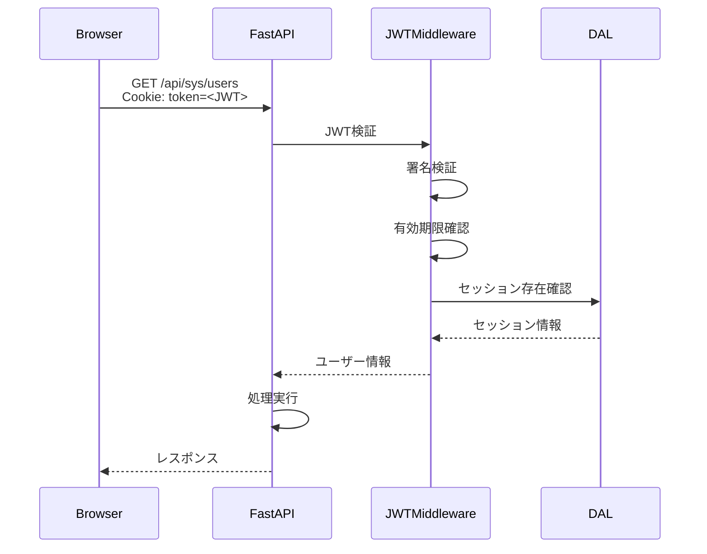
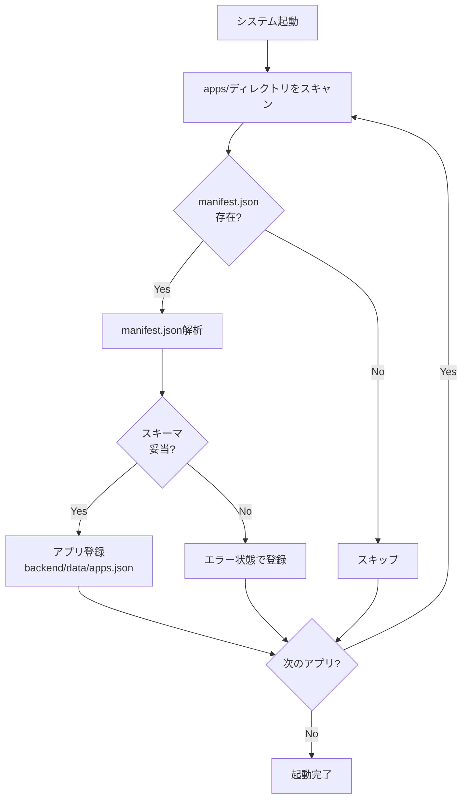

# システムアーキテクチャ設計書（システム共通基盤）

| 項目 | 内容 |
|------|------|
| 作成日 | 2026年5月28日 |
| バージョン | 1.0 |
| 対象 | システム共通基盤（sys） |
| 工程 | 工程2: 基本設計 |

---

## 1. 全体構成

### 1.1 システム構成図

```
┌─────────────────────────────────────────────────────────────┐
│                        ブラウザ                              │
│  ┌─────────────────────────────────────────────────────┐   │
│  │  TypeScript SPA (Vite + Alpine.js + Bootstrap)     │   │
│  │  - システム共通UI（認証・ポータル・管理画面）      │   │
│  │  - アプリUI（apps/*/frontend/dist/）               │   │
│  └─────────────────────────────────────────────────────┘   │
│           │                                                  │
│           │ REST API (JSON) / SSE                           │
│           │ JWT httpOnly Cookie                             │
└───────────┼──────────────────────────────────────────────────┘
            │
            ▼
┌─────────────────────────────────────────────────────────────┐
│              FastAPI (Python 3.9+)                          │
│  ┌─────────────────────────────────────────────────────┐   │
│  │  静的ファイル配信層                                  │   │
│  │  - frontend/dist/                                    │   │
│  │  - apps/*/frontend/dist/                             │   │
│  └─────────────────────────────────────────────────────┘   │
│  ┌─────────────────────────────────────────────────────┐   │
│  │  API層                                               │   │
│  │  - システム共通API (/api/sys/*)                     │   │
│  │  - アプリAPI (/api/<app-name>/*)                    │   │
│  │  - SSE通知配信 (/api/sys/notifications/stream)      │   │
│  └─────────────────────────────────────────────────────┘   │
│  ┌─────────────────────────────────────────────────────┐   │
│  │  認証・認可層                                        │   │
│  │  - JWT生成・検証（httpOnly Cookie）                 │   │
│  │  - 権限チェック（admin, user）                      │   │
│  └─────────────────────────────────────────────────────┘   │
│  ┌─────────────────────────────────────────────────────┐   │
│  │  DAL（データアクセス層）                            │   │
│  │  - JSON DB実装（現状）                              │   │
│  │  - RDB実装（将来対応）                              │   │
│  │  - インターフェース統一                             │   │
│  └─────────────────────────────────────────────────────┘   │
└───────────┬─────────────────────────────────────────────────┘
            │
            ▼
┌─────────────────────────────────────────────────────────────┐
│                   データ層（JSONファイル）                   │
│  - backend/data/users.json         （ユーザー情報）         │
│  - backend/data/sessions/          （セッション情報）       │
│  - backend/data/apps.json          （アプリ設定）           │
│  - backend/data/config.json        （システム設定）         │
│  - apps/*/backend/data/            （アプリ固有データ）     │
└─────────────────────────────────────────────────────────────┘
```

### 1.2 レイヤー構成

| レイヤー | 責務 | 技術 |
|---------|------|------|
| **プレゼンテーション層** | UI表示・ユーザーインタラクション | TypeScript + Alpine.js + Bootstrap 5 |
| **API層** | RESTエンドポイント提供・リクエスト処理 | FastAPI |
| **ビジネスロジック層** | 業務ロジック・検証・制御 | Python（FastAPI内） |
| **認証・認可層** | JWT検証・権限チェック | FastAPI Dependency |
| **DAL層** | データアクセス抽象化 | Python（JSON/RDB抽象化） |
| **データ層** | データ永続化 | JSONファイル（将来: RDB） |

---

## 2. 認証フロー

### 2.1 ログイン処理

```mermaid
sequenceDiagram
    participant Browser
    participant FastAPI
    participant DAL
    participant JSONFile

    Browser->>FastAPI: POST /api/sys/auth/login<br/>{username, password}
    FastAPI->>DAL: ユーザー検証
    DAL->>JSONFile: backend/data/users.json読み込み
    JSONFile-->>DAL: ユーザー情報
    DAL-->>FastAPI: パスワードハッシュ検証
    FastAPI->>FastAPI: JWTトークン生成
    FastAPI->>DAL: セッション情報保存
    DAL->>JSONFile: backend/data/sessions/<session_id>.json
    FastAPI-->>Browser: Set-Cookie: token=<JWT>; HttpOnly; SameSite=Strict
    FastAPI-->>Browser: {success: true, user: {...}}
```

### 2.2 JWT検証フロー



### 2.3 JWT仕様

| 項目 | 仕様 |
|------|------|
| **アルゴリズム** | HS256（HMAC SHA-256） |
| **有効期限** | 24時間（カスタマイズ可能） |
| **ペイロード** | `{sub: user_id, username: "...", role: "admin"\|"user", exp: ...}` |
| **Cookie設定** | `HttpOnly`, `SameSite=Strict`, `Secure`（本番のみ） |
| **Cookie名** | `auth_token` |

---

## 3. アプリプラグイン機構

### 3.1 アプリ認識フロー



### 3.2 アプリ有効化・無効化

**データ構造**（`backend/data/apps.json`）：

```json
{
  "apps": [
    {
      "id": "todo-app",
      "name": "TODO管理",
      "version": "1.0.0",
      "enabled": true,
      "manifest_path": "apps/todo-app/manifest.json",
      "last_updated": "2026-05-28T10:00:00Z"
    },
    {
      "id": "calendar-app",
      "name": "カレンダー",
      "version": "1.0.0",
      "enabled": false,
      "manifest_path": "apps/calendar-app/manifest.json",
      "last_updated": "2026-05-28T10:00:00Z"
    }
  ]
}
```

**有効化判定**：
- 管理画面で `enabled: true` に設定
- ナビゲーションメニューに表示
- APIアクセス許可

**無効化判定**：
- 管理画面で `enabled: false` に設定
- ナビゲーションメニューから非表示
- APIアクセスは403エラー
- URL直接アクセスはシステムポータルにリダイレクト

### 3.3 アプリルーティング

| パターン | ルーティング先 | 説明 |
|---------|--------------|------|
| `/apps/<app-name>/` | `apps/<app-name>/frontend/dist/index.html` | アプリのフロントエンド |
| `/api/<app-name>/*` | `apps/<app-name>/backend/app/main.py` | アプリのAPI |

---

## 4. セキュリティアーキテクチャ

### 4.1 XSS対策

| 対策 | 実装箇所 | 方法 |
|------|---------|------|
| **入力エスケープ** | Alpine.js | `x-text`, `x-html`の適切な使い分け |
| **Content Security Policy** | FastAPI | HTTPヘッダー `Content-Security-Policy` 設定 |
| **httpOnly Cookie** | FastAPI | JWTトークンをhttpOnly Cookieに格納 |

**CSP設定例**：

```
Content-Security-Policy: default-src 'self'; script-src 'self' 'unsafe-inline'; style-src 'self' 'unsafe-inline'; img-src 'self' data:;
```

### 4.2 CSRF対策

| 対策 | 実装箇所 | 方法 |
|------|---------|------|
| **SameSite Cookie** | FastAPI | `SameSite=Strict` 設定 |
| **Origin検証** | FastAPI Middleware | `Origin`/`Referer` ヘッダー検証 |
| **CSRFトークン** | Alpine.js + FastAPI | 状態変更APIにトークン要求（オプション） |

### 4.3 CORS設定

| 環境 | CORS設定 |
|------|---------|
| **開発環境** | `http://localhost:5173` のみ許可 |
| **本番環境** | 同一オリジンのみ（CORS無効） |

```python
# FastAPI設定例
from fastapi.middleware.cors import CORSMiddleware

if settings.ENV == "development":
    app.add_middleware(
        CORSMiddleware,
        allow_origins=["http://localhost:5173"],
        allow_credentials=True,
        allow_methods=["*"],
        allow_headers=["*"],
    )
```

### 4.4 パスワードハッシュ化

| 項目 | 仕様 |
|------|------|
| **アルゴリズム** | bcrypt（推奨）または Argon2 |
| **ソルト** | 自動生成（bcryptライブラリ） |
| **コスト** | bcrypt rounds=12 |

```python
# パスワードハッシュ化例
from passlib.context import CryptContext

pwd_context = CryptContext(schemes=["bcrypt"], deprecated="auto")

# ハッシュ化
hashed = pwd_context.hash("plain_password")

# 検証
is_valid = pwd_context.verify("plain_password", hashed)
```

---

## 5. システムポータルページ設計

### 5.1 ポータルページ機能

**URL**: `/` または `/portal`

**表示内容**：
1. **システム情報セクション**
   - ログイン中のユーザー名
   - 権限（管理者/一般ユーザー）
   - ログイン時刻
   - ホームボタン（ポータルに戻る）

2. **有効化アプリ一覧セクション**
   - アプリカード表示（グリッドレイアウト）
   - 各カード要素：
     - アプリアイコン（manifest.jsonの `icon` フィールド）
     - アプリ名（manifest.jsonの `displayName` フィールド）
     - 説明（manifest.jsonの `description` フィールド）
     - 起動ボタン（`entryPoint` にリンク）

3. **管理機能セクション**（管理者のみ表示）
   - ユーザー管理リンク
   - アプリ管理リンク

### 5.2 アプリカード表示ロジック

```typescript
// ポータル表示時の処理フロー
async function loadPortal() {
  // 1. 認証確認
  const user = await fetch('/api/sys/auth/me').then(r => r.json());
  
  // 2. 有効化アプリ一覧取得
  const apps = await fetch('/api/sys/apps?enabled=true').then(r => r.json());
  
  // 3. アプリカード表示
  renderAppCards(apps);
  
  // 4. システム情報表示
  renderSystemInfo(user);
}
```

### 5.3 無効化アプリアクセス拒否

**フロントエンドルーティング**（Vite Router または Alpine.js）：

```typescript
// URL直接アクセス時のチェック
router.beforeEach(async (to, from, next) => {
  if (to.path.startsWith('/apps/')) {
    const appName = to.path.split('/')[2];
    const app = await fetch(`/api/sys/apps/${appName}`).then(r => r.json());
    
    if (!app.enabled) {
      // ポータルにリダイレクト
      next('/portal');
      return;
    }
  }
  next();
});
```

**バックエンドミドルウェア**：

```python
# FastAPI ミドルウェア
@app.middleware("http")
async def check_app_enabled(request: Request, call_next):
    if request.url.path.startswith("/api/"):
        app_name = request.url.path.split("/")[2]
        if not is_app_enabled(app_name):
            return JSONResponse(
                status_code=403,
                content={"error": "App is disabled"}
            )
    return await call_next(request)
```

---

## 6. SSE（Server-Sent Events）設計

### 6.1 SSE通知配信

**エンドポイント**: `/api/sys/notifications/stream`

**用途**：
- リアルタイム通知配信
- 進捗状況の配信
- システムイベント通知

**実装例**：

```python
from fastapi import APIRouter
from sse_starlette.sse import EventSourceResponse

router = APIRouter()

@router.get("/notifications/stream")
async def notification_stream(request: Request, user: User = Depends(get_current_user)):
    async def event_generator():
        while True:
            # クライアント切断確認
            if await request.is_disconnected():
                break
            
            # 通知取得（例: キューから）
            notification = await notification_queue.get(user.id)
            
            if notification:
                yield {
                    "event": notification.type,
                    "data": notification.to_json()
                }
            
            await asyncio.sleep(1)
    
    return EventSourceResponse(event_generator())
```

**クライアント側実装**：

```typescript
const eventSource = new EventSource('/api/sys/notifications/stream');

eventSource.addEventListener('notification', (event) => {
  const data = JSON.parse(event.data);
  showNotification(data.message);
});

eventSource.addEventListener('error', (error) => {
  console.error('SSE error:', error);
  eventSource.close();
});
```

---

## 7. DAL（データアクセス層）設計

### 7.1 DAL抽象化インターフェース

```python
from abc import ABC, abstractmethod
from typing import Any, Dict, List, Optional

class DataAccessLayer(ABC):
    @abstractmethod
    async def get(self, collection: str, id: str) -> Optional[Dict[str, Any]]:
        """単一レコード取得"""
        pass
    
    @abstractmethod
    async def list(self, collection: str, filter: Optional[Dict] = None) -> List[Dict[str, Any]]:
        """レコード一覧取得"""
        pass
    
    @abstractmethod
    async def create(self, collection: str, data: Dict[str, Any]) -> Dict[str, Any]:
        """レコード作成"""
        pass
    
    @abstractmethod
    async def update(self, collection: str, id: str, data: Dict[str, Any]) -> Dict[str, Any]:
        """レコード更新"""
        pass
    
    @abstractmethod
    async def delete(self, collection: str, id: str) -> bool:
        """レコード削除"""
        pass
```

### 7.2 JSON DB実装

```python
class JSONDataAccessLayer(DataAccessLayer):
    def __init__(self, base_path: str = "backend/data"):
        self.base_path = Path(base_path)
    
    async def get(self, collection: str, id: str) -> Optional[Dict[str, Any]]:
        file_path = self.base_path / f"{collection}.json"
        if not file_path.exists():
            return None
        
        data = await self._read_json(file_path)
        for item in data.get(collection, []):
            if item.get("id") == id:
                return item
        return None
    
    async def _read_json(self, path: Path) -> Dict:
        async with aiofiles.open(path, 'r') as f:
            content = await f.read()
            return json.loads(content)
    
    async def _write_json(self, path: Path, data: Dict):
        async with aiofiles.open(path, 'w') as f:
            await f.write(json.dumps(data, indent=2, ensure_ascii=False))
```

### 7.3 RDB実装（将来対応）

```python
class SQLDataAccessLayer(DataAccessLayer):
    def __init__(self, connection_string: str):
        self.engine = create_async_engine(connection_string)
    
    async def get(self, collection: str, id: str) -> Optional[Dict[str, Any]]:
        async with self.engine.begin() as conn:
            result = await conn.execute(
                text(f"SELECT * FROM {collection} WHERE id = :id"),
                {"id": id}
            )
            row = result.fetchone()
            return dict(row) if row else None
```

---

## 8. エラーハンドリング設計

### 8.1 エラーレスポンス形式

```json
{
  "error": {
    "code": "ERROR_CODE",
    "message": "ユーザー向けエラーメッセージ",
    "details": {
      "field": "username",
      "reason": "already_exists"
    }
  }
}
```

### 8.2 HTTPステータスコード

| コード | 用途 | 例 |
|-------|------|-----|
| **200 OK** | 成功 | データ取得成功 |
| **201 Created** | 作成成功 | ユーザー登録成功 |
| **400 Bad Request** | 不正なリクエスト | バリデーションエラー |
| **401 Unauthorized** | 認証エラー | JWT無効・期限切れ |
| **403 Forbidden** | 権限不足 | 管理者権限が必要 |
| **404 Not Found** | リソース未発見 | ユーザーID不存在 |
| **409 Conflict** | 競合 | ユーザー名重複 |
| **500 Internal Server Error** | サーバーエラー | 予期しない例外 |

### 8.3 エラーコード一覧

| コード | 説明 |
|-------|------|
| `AUTH_INVALID_CREDENTIALS` | ユーザー名またはパスワードが正しくない |
| `AUTH_TOKEN_EXPIRED` | JWTトークンの有効期限切れ |
| `AUTH_INSUFFICIENT_PERMISSIONS` | 権限不足 |
| `USER_NOT_FOUND` | ユーザーが見つからない |
| `USER_ALREADY_EXISTS` | ユーザー名が既に存在する |
| `APP_NOT_FOUND` | アプリが見つからない |
| `APP_DISABLED` | アプリが無効化されている |
| `APP_MANIFEST_INVALID` | manifest.jsonが不正 |
| `VALIDATION_ERROR` | バリデーションエラー |
| `INTERNAL_ERROR` | 内部エラー |

---

## 9. 性能設計

### 9.1 レスポンスタイム目標

| API種別 | 目標値 | 備考 |
|---------|--------|------|
| 認証API | 50ms以下 | ユーザー検証含む |
| データ取得API | 100ms以下 | 100件まで |
| データ更新API | 150ms以下 | バリデーション含む |
| SSE初期接続 | 200ms以下 | 初回接続確立 |

### 9.2 キャッシュ戦略

| データ種別 | キャッシュ方法 | 有効期限 |
|-----------|---------------|---------|
| manifest.json | メモリキャッシュ | 起動時読み込み、再起動まで |
| apps.json | メモリキャッシュ | 更新時に無効化 |
| ユーザー情報 | リクエスト単位 | キャッシュなし（セキュリティ） |

---

## 10. デプロイメント設計

### 10.1 開発環境

```bash
# フロントエンド開発サーバー
npm run dev  # http://localhost:5173

# バックエンド開発サーバー
uvicorn backend.app.main:app --reload --port 8000
```

### 10.2 本番環境

```bash
# フロントエンドビルド
npm run build  # → frontend/dist/

# FastAPI起動（静的ファイル配信 + API）
uvicorn backend.app.main:app --host 0.0.0.0 --port 8000
```

**FastAPI静的ファイル配信**：

```python
from fastapi.staticfiles import StaticFiles

app.mount("/assets", StaticFiles(directory="frontend/dist/assets"), name="assets")
app.mount("/apps", StaticFiles(directory="apps"), name="apps")

@app.get("/{full_path:path}")
async def serve_spa(full_path: str):
    # SPAルーティング対応
    return FileResponse("frontend/dist/index.html")
```

---

## 関連ドキュメント

- [API設計書](./api-design.md)
- [画面設計書](./screen-design.md)
- [manifest.jsonスキーマ](./manifest-schema.md)
- [ディレクトリ構成](./directory-structure.md)
- [工程1: 要件定義](../01-requirements/)
