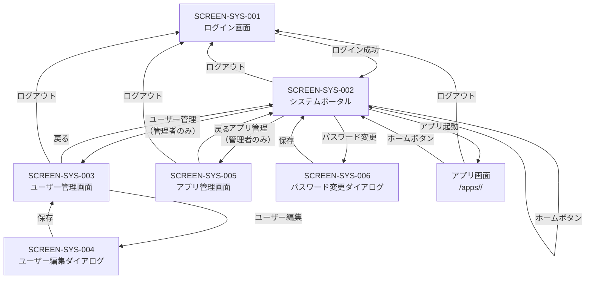

# 画面設計書（システム共通基盤）

| 項目 | 内容 |
|------|------|
| 作成日 | 2026年5月28日 |
| バージョン | 1.0 |
| 対象 | システム共通基盤（sys） |
| 工程 | 工程2: 基本設計 |

---

## 1. 画面一覧

| 画面ID | 画面名 | URL | 権限 | 説明 |
|--------|-------|-----|------|------|
| SCREEN-SYS-001 | ログイン画面 | `/login` | なし | ユーザー認証画面 |
| SCREEN-SYS-002 | システムポータルページ | `/` または `/portal` | ログイン必須 | 有効化アプリ一覧表示・ランディングページ |
| SCREEN-SYS-003 | ユーザー管理画面 | `/users` | 管理者 | ユーザー一覧・登録・編集・削除 |
| SCREEN-SYS-004 | ユーザー編集ダイアログ | （モーダル） | 管理者 | ユーザー情報編集 |
| SCREEN-SYS-005 | アプリ管理画面 | `/apps` | 管理者 | アプリ一覧・有効化・無効化 |
| SCREEN-SYS-006 | パスワード変更ダイアログ | （モーダル） | ログイン必須 | 自分のパスワード変更 |

---

## 2. 画面遷移図



---

## 3. 共通レイアウト

### 3.1 ヘッダー（全画面共通）

```
┌─────────────────────────────────────────────────────────────────┐
│ [ホーム] Webシステム                         [ユーザー名 ▼]     │
│                                              └─ パスワード変更   │
│                                              └─ ログアウト       │
└─────────────────────────────────────────────────────────────────┘
```

**要素**：
- **ホームボタン**: システムポータルページに戻る
- **システム名**: "Webシステム"（設定可能）
- **ユーザー名ドロップダウン**: ログイン中のユーザー名表示
  - パスワード変更
  - ログアウト

### 3.2 ナビゲーションメニュー（ログイン後）

```
┌─────────────────────────────────────────────────────────────────┐
│ ナビゲーション                                                   │
├─────────────────────────────────────────────────────────────────┤
│ ▸ システム管理（管理者のみ）                                     │
│   ├─ ユーザー管理                                               │
│   └─ アプリ管理                                                 │
│                                                                  │
│ ▸ アプリケーション                                               │
│   ├─ [アイコン] TODO管理                                        │
│   └─ [アイコン] カレンダー                                      │
└─────────────────────────────────────────────────────────────────┘
```

**表示ルール**：
- 管理者権限を持つユーザーのみ「システム管理」セクション表示
- 「アプリケーション」セクションには有効化されたアプリのみ表示
- アプリのアイコンと名前（manifest.jsonの `displayName`）を表示

---

## 4. SCREEN-SYS-001: ログイン画面

### 4.1 ワイヤーフレーム

```
┌─────────────────────────────────────────────────────────────────┐
│                                                                  │
│                          Webシステム                             │
│                                                                  │
│                   ┌──────────────────────────┐                  │
│                   │  ログイン                │                  │
│                   ├──────────────────────────┤                  │
│                   │                          │                  │
│                   │  ユーザー名              │                  │
│                   │  [________________]      │                  │
│                   │                          │                  │
│                   │  パスワード              │                  │
│                   │  [________________]      │                  │
│                   │                          │                  │
│                   │  [ ログイン ]            │                  │
│                   │                          │                  │
│                   │  ※エラーメッセージ      │                  │
│                   │                          │                  │
│                   └──────────────────────────┘                  │
│                                                                  │
│                                                                  │
└─────────────────────────────────────────────────────────────────┘
```

### 4.2 要素定義

| 要素 | タイプ | 説明 | バリデーション |
|------|--------|------|--------------|
| ユーザー名 | テキスト入力 | ユーザー名を入力 | 必須 |
| パスワード | パスワード入力 | パスワードを入力 | 必須 |
| ログインボタン | ボタン | ログイン処理を実行 | - |
| エラーメッセージ | テキスト表示 | 認証失敗時に表示 | - |

### 4.3 画面動作

1. **初期表示**
   - JWTトークンが有効な場合、システムポータルにリダイレクト
   - JWTトークンが無効または存在しない場合、ログイン画面を表示

2. **ログインボタンクリック**
   - バリデーション実行（必須チェック）
   - `POST /api/sys/auth/login` を呼び出し
   - 成功時: システムポータルにリダイレクト
   - 失敗時: エラーメッセージを表示

3. **エラー表示**
   - 「ユーザー名またはパスワードが正しくありません」
   - 「ユーザー名を入力してください」
   - 「パスワードを入力してください」

### 4.4 Alpine.js実装例

```html
<div x-data="loginForm()">
  <form @submit.prevent="login">
    <div class="mb-3">
      <label for="username" class="form-label">ユーザー名</label>
      <input 
        type="text" 
        id="username" 
        class="form-control" 
        x-model="username" 
        required
      >
    </div>
    
    <div class="mb-3">
      <label for="password" class="form-label">パスワード</label>
      <input 
        type="password" 
        id="password" 
        class="form-control" 
        x-model="password" 
        required
      >
    </div>
    
    <div x-show="error" class="alert alert-danger" x-text="error"></div>
    
    <button type="submit" class="btn btn-primary w-100" :disabled="loading">
      <span x-show="loading">ログイン中...</span>
      <span x-show="!loading">ログイン</span>
    </button>
  </form>
</div>

<script>
function loginForm() {
  return {
    username: '',
    password: '',
    error: '',
    loading: false,
    
    async login() {
      this.error = '';
      this.loading = true;
      
      try {
        const response = await fetch('/api/sys/auth/login', {
          method: 'POST',
          headers: { 'Content-Type': 'application/json' },
          body: JSON.stringify({
            username: this.username,
            password: this.password
          })
        });
        
        const data = await response.json();
        
        if (response.ok) {
          window.location.href = '/portal';
        } else {
          this.error = data.error.message;
        }
      } catch (error) {
        this.error = 'ログインに失敗しました';
      } finally {
        this.loading = false;
      }
    }
  };
}
</script>
```

---

## 5. SCREEN-SYS-002: システムポータルページ

### 5.1 ワイヤーフレーム

```
┌─────────────────────────────────────────────────────────────────┐
│ [ホーム] Webシステム                         [管理者 ▼]         │
└─────────────────────────────────────────────────────────────────┘
│                                                                  │
│  システムポータル                                                │
│                                                                  │
│  ┌────────────────────────────────────────────────────────┐    │
│  │ ようこそ、管理者さん                                   │    │
│  │ 権限: 管理者                                           │    │
│  │ ログイン時刻: 2026-05-28 09:00:00                     │    │
│  └────────────────────────────────────────────────────────┘    │
│                                                                  │
│  有効化されたアプリケーション                                    │
│                                                                  │
│  ┌────────────┐  ┌────────────┐  ┌────────────┐              │
│  │ [アイコン] │  │ [アイコン] │  │ [アイコン] │              │
│  │ TODO管理   │  │ カレンダー │  │ メモ帳     │              │
│  ├────────────┤  ├────────────┤  ├────────────┤              │
│  │ タスク管理 │  │ スケジュール│  │ メモ作成   │              │
│  │ アプリ     │  │ 管理        │  │            │              │
│  │            │  │            │  │            │              │
│  │ [起動]     │  │ [起動]     │  │ [起動]     │              │
│  └────────────┘  └────────────┘  └────────────┘              │
│                                                                  │
│  システム管理（管理者のみ）                                      │
│                                                                  │
│  [ユーザー管理]  [アプリ管理]                                   │
│                                                                  │
└─────────────────────────────────────────────────────────────────┘
```

### 5.2 要素定義

| セクション | 要素 | 説明 |
|-----------|------|------|
| **システム情報** | ユーザー名表示 | "ようこそ、{ユーザー名}さん" |
| | 権限表示 | "権限: 管理者" または "権限: 一般ユーザー" |
| | ログイン時刻 | 最終ログイン時刻を表示 |
| **アプリカード** | アイコン | manifest.jsonの `icon` フィールド |
| | アプリ名 | manifest.jsonの `displayName` フィールド |
| | 説明 | manifest.jsonの `description` フィールド |
| | 起動ボタン | manifest.jsonの `entryPoint` にリンク |
| **システム管理** | ユーザー管理ボタン | `/users` にリンク（管理者のみ） |
| | アプリ管理ボタン | `/apps` にリンク（管理者のみ） |

### 5.3 画面動作

1. **初期表示**
   - `GET /api/sys/auth/me` でユーザー情報取得
   - `GET /api/sys/apps?enabled=true` で有効化アプリ一覧取得
   - システム情報セクションを表示
   - アプリカードをグリッドレイアウトで表示
   - 管理者権限がある場合、システム管理セクションを表示

2. **アプリ起動**
   - アプリカードの「起動」ボタンをクリック
   - manifest.jsonの `entryPoint` にリダイレクト

3. **ユーザー管理・アプリ管理**
   - 管理者のみ表示されるボタンをクリック
   - 該当画面にリダイレクト

### 5.4 Alpine.js実装例

```html
<div x-data="portalPage()" x-init="init">
  <!-- システム情報 -->
  <div class="card mb-4">
    <div class="card-body">
      <h5 x-text="'ようこそ、' + user.displayName + 'さん'"></h5>
      <p>権限: <span x-text="user.role === 'admin' ? '管理者' : '一般ユーザー'"></span></p>
      <p>ログイン時刻: <span x-text="formatDateTime(user.lastLogin)"></span></p>
    </div>
  </div>
  
  <!-- 有効化アプリ一覧 -->
  <h4>有効化されたアプリケーション</h4>
  <div class="row">
    <template x-for="app in apps" :key="app.id">
      <div class="col-md-4 mb-3">
        <div class="card">
          
          <div class="card-body">
            <h5 class="card-title" x-text="app.name"></h5>
            <p class="card-text" x-text="app.description"></p>
            <a :href="app.entryPoint" class="btn btn-primary">起動</a>
          </div>
        </div>
      </div>
    </template>
  </div>
  
  <!-- システム管理（管理者のみ） -->
  <div x-show="user.role === 'admin'" class="mt-4">
    <h4>システム管理</h4>
    <a href="/users" class="btn btn-secondary me-2">ユーザー管理</a>
    <a href="/apps" class="btn btn-secondary">アプリ管理</a>
  </div>
</div>

<script>
function portalPage() {
  return {
    user: {},
    apps: [],
    
    async init() {
      await this.loadUser();
      await this.loadApps();
    },
    
    async loadUser() {
      const response = await fetch('/api/sys/auth/me');
      this.user = await response.json();
    },
    
    async loadApps() {
      const response = await fetch('/api/sys/apps?enabled=true');
      const data = await response.json();
      this.apps = data.apps;
    },
    
    formatDateTime(dateStr) {
      return new Date(dateStr).toLocaleString('ja-JP');
    }
  };
}
</script>
```

---

## 6. SCREEN-SYS-003: ユーザー管理画面

### 6.1 ワイヤーフレーム

```
┌─────────────────────────────────────────────────────────────────┐
│ [ホーム] Webシステム                         [管理者 ▼]         │
└─────────────────────────────────────────────────────────────────┘
│                                                                  │
│  ユーザー管理                              [+ 新規ユーザー登録] │
│                                                                  │
│  ┌────────────────────────────────────────────────────────┐    │
│  │ ユーザーID │ ユーザー名 │ 表示名   │ 権限    │ 操作   │    │
│  ├────────────────────────────────────────────────────────┤    │
│  │ user_001   │ admin      │ 管理者   │ 管理者  │ [編集] │    │
│  │ user_002   │ user1      │ ユーザー1│ ユーザー│ [編集] │    │
│  │            │            │          │         │ [削除] │    │
│  │ user_003   │ user2      │ ユーザー2│ ユーザー│ [編集] │    │
│  │            │            │          │         │ [削除] │    │
│  └────────────────────────────────────────────────────────┘    │
│                                                                  │
│  [戻る]                                                          │
│                                                                  │
└─────────────────────────────────────────────────────────────────┘
```

### 6.2 要素定義

| 要素 | タイプ | 説明 |
|------|--------|------|
| 新規ユーザー登録ボタン | ボタン | ユーザー編集ダイアログを開く（新規モード） |
| ユーザー一覧テーブル | テーブル | 全ユーザーを一覧表示 |
| 編集ボタン | ボタン | ユーザー編集ダイアログを開く（編集モード） |
| 削除ボタン | ボタン | ユーザー削除確認ダイアログを開く |
| 戻るボタン | ボタン | システムポータルに戻る |

### 6.3 画面動作

1. **初期表示**
   - `GET /api/sys/users` でユーザー一覧取得
   - テーブルに表示

2. **新規ユーザー登録**
   - 「新規ユーザー登録」ボタンをクリック
   - ユーザー編集ダイアログを開く（新規モード）

3. **ユーザー編集**
   - 「編集」ボタンをクリック
   - ユーザー編集ダイアログを開く（編集モード）

4. **ユーザー削除**
   - 「削除」ボタンをクリック
   - 確認ダイアログ表示
   - 確認後、`DELETE /api/sys/users/{user_id}` 呼び出し
   - 一覧を再読み込み

---

## 7. SCREEN-SYS-004: ユーザー編集ダイアログ

### 7.1 ワイヤーフレーム

```
┌─────────────────────────────────────────────┐
│ ユーザー編集                    [×]         │
├─────────────────────────────────────────────┤
│                                              │
│  ユーザー名（必須）                          │
│  [_____________________]                     │
│                                              │
│  パスワード（新規登録時必須）                │
│  [_____________________]                     │
│                                              │
│  表示名（必須）                              │
│  [_____________________]                     │
│                                              │
│  メールアドレス                              │
│  [_____________________]                     │
│                                              │
│  権限                                        │
│  ( ) 一般ユーザー                            │
│  ( ) 管理者                                  │
│                                              │
│               [キャンセル]  [保存]           │
│                                              │
└─────────────────────────────────────────────┘
```

### 7.2 要素定義

| 要素 | タイプ | 説明 | バリデーション |
|------|--------|------|--------------|
| ユーザー名 | テキスト入力 | ユーザー名 | 必須、英数字とハイフン |
| パスワード | パスワード入力 | パスワード | 新規時必須、8文字以上 |
| 表示名 | テキスト入力 | 表示名 | 必須 |
| メールアドレス | メール入力 | メールアドレス | メール形式 |
| 権限 | ラジオボタン | 一般ユーザー or 管理者 | 必須 |
| 保存ボタン | ボタン | 保存処理実行 | - |
| キャンセルボタン | ボタン | ダイアログを閉じる | - |

### 7.3 画面動作

1. **新規登録モード**
   - 全フィールドを空欄で表示
   - パスワードを必須にする
   - 「保存」ボタンで `POST /api/sys/users` 呼び出し

2. **編集モード**
   - 既存ユーザー情報をフィールドに設定
   - パスワードは空欄（変更する場合のみ入力）
   - 「保存」ボタンで `PUT /api/sys/users/{user_id}` 呼び出し

3. **バリデーション**
   - 必須項目チェック
   - パスワード長チェック（8文字以上）
   - メール形式チェック

---

## 8. SCREEN-SYS-005: アプリ管理画面

### 8.1 ワイヤーフレーム

```
┌─────────────────────────────────────────────────────────────────┐
│ [ホーム] Webシステム                         [管理者 ▼]         │
└─────────────────────────────────────────────────────────────────┘
│                                                                  │
│  アプリ管理                                  [再読み込み]        │
│                                                                  │
│  ┌────────────────────────────────────────────────────────┐    │
│  │ アプリID    │ アプリ名   │ バージョン│ 状態    │ 操作  │    │
│  ├────────────────────────────────────────────────────────┤    │
│  │ todo-app    │ TODO管理   │ 1.0.0     │ 有効    │[無効化]│    │
│  │ calendar-app│ カレンダー │ 1.0.0     │ 無効    │[有効化]│    │
│  │ memo-app    │ メモ帳     │ 1.0.0     │ 有効    │[無効化]│    │
│  └────────────────────────────────────────────────────────┘    │
│                                                                  │
│  [戻る]                                                          │
│                                                                  │
└─────────────────────────────────────────────────────────────────┘
```

### 8.2 要素定義

| 要素 | タイプ | 説明 |
|------|--------|------|
| 再読み込みボタン | ボタン | `POST /api/sys/apps/reload` を呼び出し、アプリを再スキャン |
| アプリ一覧テーブル | テーブル | 全アプリを一覧表示 |
| 有効化ボタン | ボタン | アプリを有効化（無効状態のアプリのみ表示） |
| 無効化ボタン | ボタン | アプリを無効化（有効状態のアプリのみ表示） |
| 戻るボタン | ボタン | システムポータルに戻る |

### 8.3 画面動作

1. **初期表示**
   - `GET /api/sys/apps` でアプリ一覧取得
   - テーブルに表示

2. **アプリ再読み込み**
   - 「再読み込み」ボタンをクリック
   - `POST /api/sys/apps/reload` 呼び出し
   - 一覧を再読み込み

3. **アプリ有効化**
   - 「有効化」ボタンをクリック
   - `POST /api/sys/apps/{app_id}/enable` 呼び出し
   - 一覧を再読み込み
   - 成功メッセージ表示

4. **アプリ無効化**
   - 「無効化」ボタンをクリック
   - `POST /api/sys/apps/{app_id}/disable` 呼び出し
   - 一覧を再読み込み
   - 成功メッセージ表示

---

## 9. SCREEN-SYS-006: パスワード変更ダイアログ

### 9.1 ワイヤーフレーム

```
┌─────────────────────────────────────────────┐
│ パスワード変更                  [×]         │
├─────────────────────────────────────────────┤
│                                              │
│  現在のパスワード（必須）                    │
│  [_____________________]                     │
│                                              │
│  新しいパスワード（必須）                    │
│  [_____________________]                     │
│                                              │
│  新しいパスワード（確認）                    │
│  [_____________________]                     │
│                                              │
│               [キャンセル]  [変更]           │
│                                              │
└─────────────────────────────────────────────┘
```

### 9.2 要素定義

| 要素 | タイプ | 説明 | バリデーション |
|------|--------|------|--------------|
| 現在のパスワード | パスワード入力 | 現在のパスワード | 必須 |
| 新しいパスワード | パスワード入力 | 新しいパスワード | 必須、8文字以上 |
| 新しいパスワード（確認） | パスワード入力 | 確認用パスワード | 必須、新しいパスワードと一致 |
| 変更ボタン | ボタン | パスワード変更実行 | - |
| キャンセルボタン | ボタン | ダイアログを閉じる | - |

### 9.3 画面動作

1. **入力**
   - 現在のパスワード、新しいパスワード、確認用パスワードを入力

2. **バリデーション**
   - 必須項目チェック
   - 新しいパスワードが8文字以上
   - 新しいパスワードと確認用パスワードが一致

3. **変更処理**
   - 「変更」ボタンをクリック
   - `PUT /api/sys/auth/password` 呼び出し
   - 成功時: ダイアログを閉じ、成功メッセージ表示
   - 失敗時: エラーメッセージ表示

---

## 10. 共通UIコンポーネント

### 10.1 トースト通知

```
┌─────────────────────────────────────────┐
│ ✓ ユーザーを登録しました        [×]    │
└─────────────────────────────────────────┘
```

**用途**: 成功・エラー・情報メッセージの表示

**タイプ**:
- `success`: 緑背景、チェックアイコン
- `error`: 赤背景、エラーアイコン
- `warning`: 黄背景、警告アイコン
- `info`: 青背景、情報アイコン

**表示位置**: 画面右上

**表示時間**: 3秒間自動消去（エラーは5秒）

### 10.2 確認ダイアログ

```
┌─────────────────────────────────────────┐
│ 確認                        [×]         │
├─────────────────────────────────────────┤
│                                          │
│  本当にこのユーザーを削除しますか？      │
│                                          │
│           [キャンセル]  [削除]           │
│                                          │
└─────────────────────────────────────────┘
```

**用途**: 重要な操作（削除など）の確認

### 10.3 ローディングスピナー

```
  ┌──────┐
  │  ⏳  │  読み込み中...
  └──────┘
```

**用途**: API呼び出し中の表示

**表示位置**: 画面中央またはボタン内

---

## 関連ドキュメント

- [システムアーキテクチャ設計書](./architecture.md)
- [API設計書](./api-design.md)
- [manifest.jsonスキーマ](./manifest-schema.md)
- [工程1: 要件定義](../01-requirements/)
