# クラス設計書（システム共通基盤）

| 項目 | 内容 |
|------|------|
| 作成日 | 2026年5月28日 |
| バージョン | 1.0 |
| 対象 | システム共通基盤（sys） |
| 工程 | 工程3: 詳細設計 |

---

## 1. クラス図（全体構成）

```mermaid
classDiagram
    %% エンティティ層
    class User {
        +string id
        +string username
        +string passwordHash
        +string displayName
        +string role
        +string email
        +dict metadata
        +datetime createdAt
        +datetime updatedAt
        +datetime lastLogin
        +validate_password(password: str) bool
        +to_dict() dict
    }

    class App {
        +string id
        +string name
        +string version
        +string description
        +string icon
        +string entryPoint
        +string apiPrefix
        +bool enabled
        +string author
        +list requiredPermissions
        +list dependencies
        +dict manifest
        +datetime lastUpdated
        +to_dict() dict
        +validate_manifest() bool
    }

    class Notification {
        +string id
        +string userId
        +string type
        +string title
        +string message
        +dict metadata
        +bool read
        +datetime createdAt
        +datetime expiresAt
        +to_dict() dict
        +is_expired() bool
    }

    class Session {
        +string sessionId
        +string userId
        +string token
        +datetime createdAt
        +datetime expiresAt
        +dict metadata
        +is_valid() bool
        +refresh() None
        +to_dict() dict
    }

    %% サービス層
    class JWTService {
        -string secret_key
        -string algorithm
        -int expiration_hours
        +create_token(user: User) str
        +verify_token(token: str) dict
        +decode_token(token: str) dict
        +refresh_token(token: str) str
    }

    class NotificationService {
        -NotificationDAL dal
        -dict active_connections
        +create_notification(user_id: str, type: str, title: str, message: str, metadata: dict) Notification
        +get_user_notifications(user_id: str, unread_only: bool) list
        +mark_as_read(notification_id: str, user_id: str) bool
        +delete_notification(notification_id: str, user_id: str) bool
        +stream_notifications(user_id: str) AsyncGenerator
        +broadcast_to_user(user_id: str, notification: Notification) None
        +cleanup_expired() int
    }

    class AuthService {
        -UserDAL user_dal
        -JWTService jwt_service
        +authenticate(username: str, password: str) tuple
        +create_session(user: User) Session
        +logout(session_id: str) bool
        +get_current_user(token: str) User
        +change_password(user_id: str, current_password: str, new_password: str) bool
        +hash_password(password: str) str
        +verify_password(password: str, hashed: str) bool
    }

    class UserService {
        -UserDAL dal
        +list_users(role: str, limit: int, offset: int) tuple
        +get_user(user_id: str) User
        +create_user(username: str, password: str, display_name: str, role: str, email: str, metadata: dict) User
        +update_user(user_id: str, data: dict) User
        +delete_user(user_id: str) bool
        +validate_user_data(data: dict) tuple
    }

    class AppService {
        -AppDAL dal
        +scan_apps() list
        +list_apps(enabled: bool) list
        +get_app(app_id: str) App
        +enable_app(app_id: str) bool
        +disable_app(app_id: str) bool
        +validate_app_manifest(manifest: dict) tuple
        +reload_app(app_id: str) App
    }

    %% DAL層（抽象クラス）
    class BaseDAL {
        <<abstract>>
        #string collection_name
        +find(criteria: dict, limit: int, offset: int) list
        +find_one(criteria: dict) dict
        +insert(data: dict) str
        +update(id: str, data: dict) bool
        +delete(id: str) bool
        +count(criteria: dict) int
        +exists(criteria: dict) bool
    }

    %% DAL層（JSON実装）
    class JsonDAL {
        -string data_dir
        -dict cache
        -Lock lock
        +_load_data() dict
        +_save_data(data: dict) None
        +_generate_id() str
        +find(criteria: dict, limit: int, offset: int) list
        +find_one(criteria: dict) dict
        +insert(data: dict) str
        +update(id: str, data: dict) bool
        +delete(id: str) bool
        +count(criteria: dict) int
        +exists(criteria: dict) bool
    }

    %% DAL層（具体実装）
    class UserDAL {
        +string collection_name = "users"
        +find_by_username(username: str) dict
        +find_by_email(email: str) dict
        +update_last_login(user_id: str) bool
    }

    class AppDAL {
        +string collection_name = "apps"
        +find_enabled() list
        +find_by_name(name: str) dict
    }

    class NotificationDAL {
        +string collection_name = "notifications"
        +find_by_user(user_id: str, unread_only: bool) list
        +mark_read(notification_id: str) bool
        +delete_expired() int
    }

    class SessionDAL {
        +string collection_name = "sessions"
        -string sessions_dir
        +find_by_token(token: str) dict
        +cleanup_expired() int
        +_save_session_file(session: dict) None
        +_delete_session_file(session_id: str) None
    }

    %% 継承関係
    BaseDAL <|-- JsonDAL
    JsonDAL <|-- UserDAL
    JsonDAL <|-- AppDAL
    JsonDAL <|-- NotificationDAL
    JsonDAL <|-- SessionDAL

    %% 依存関係
    AuthService ..> UserDAL
    AuthService ..> JWTService
    AuthService ..> SessionDAL
    UserService ..> UserDAL
    AppService ..> AppDAL
    NotificationService ..> NotificationDAL
    JWTService ..> User
    NotificationService ..> Notification
```



---

## 2. エンティティクラス詳細

### 2.1 User クラス

**責務**: ユーザー情報を表すエンティティ

**ファイル**: `backend/app/sys/models/user.py`

**属性**:

| 属性名 | 型 | 説明 |
|--------|-----|------|
| `id` | str | ユーザーID（UUID） |
| `username` | str | ユーザー名（一意） |
| `passwordHash` | str | パスワードハッシュ（bcrypt） |
| `displayName` | str | 表示名 |
| `role` | str | ロール（`admin`, `user`） |
| `email` | str | メールアドレス |
| `metadata` | dict | 任意のメタデータ（部署・電話番号など） |
| `createdAt` | datetime | 作成日時 |
| `updatedAt` | datetime | 更新日時 |
| `lastLogin` | datetime | 最終ログイン日時 |

**メソッド**:

| メソッド名 | 引数 | 戻り値 | 説明 |
|-----------|------|--------|------|
| `validate_password` | `password: str` | `bool` | パスワードを検証（bcrypt） |
| `to_dict` | なし | `dict` | 辞書形式に変換（passwordHashを除外） |
| `from_dict` | `data: dict` | `User` | 辞書からインスタンスを生成（クラスメソッド） |

**実装例**:

```python
from datetime import datetime
from pydantic import BaseModel, EmailStr
import bcrypt

class User(BaseModel):
    id: str
    username: str
    passwordHash: str
    displayName: str
    role: str  # "admin" or "user"
    email: EmailStr
    metadata: dict = {}
    createdAt: datetime
    updatedAt: datetime
    lastLogin: datetime | None = None

    def validate_password(self, password: str) -> bool:
        """パスワードを検証"""
        return bcrypt.checkpw(
            password.encode('utf-8'),
            self.passwordHash.encode('utf-8')
        )

    def to_dict(self, include_password: bool = False) -> dict:
        """辞書形式に変換（passwordHashを除外）"""
        data = self.model_dump()
        if not include_password:
            data.pop('passwordHash', None)
        return data

    @classmethod
    def from_dict(cls, data: dict) -> 'User':
        """辞書からインスタンスを生成"""
        return cls(**data)
```

---

### 2.2 App クラス

**責務**: アプリケーション情報を表すエンティティ

**ファイル**: `backend/app/sys/models/app.py`

**属性**:

| 属性名 | 型 | 説明 |
|--------|-----|------|
| `id` | str | アプリID（manifest.jsonの `name`） |
| `name` | str | アプリ表示名 |
| `version` | str | バージョン（セマンティックバージョニング） |
| `description` | str | 説明 |
| `icon` | str | アイコンパス（相対パス） |
| `entryPoint` | str | エントリーポイントURL |
| `apiPrefix` | str | APIプレフィックス |
| `enabled` | bool | 有効化状態 |
| `author` | str | 作成者 |
| `requiredPermissions` | list | 必要な権限リスト |
| `dependencies` | list | 依存アプリリスト |
| `manifest` | dict | manifest.json全体 |
| `lastUpdated` | datetime | 最終更新日時 |

**メソッド**:

| メソッド名 | 引数 | 戻り値 | 説明 |
|-----------|------|--------|------|
| `to_dict` | なし | `dict` | 辞書形式に変換 |
| `validate_manifest` | なし | `bool` | manifest.jsonのスキーマ検証 |
| `from_manifest` | `manifest: dict, app_path: str` | `App` | manifest.jsonからインスタンスを生成（クラスメソッド） |

**実装例**:

```python
from datetime import datetime
from pydantic import BaseModel, validator

class App(BaseModel):
    id: str
    name: str
    version: str
    description: str
    icon: str
    entryPoint: str
    apiPrefix: str
    enabled: bool = False
    author: str
    requiredPermissions: list[str] = []
    dependencies: list[str] = []
    manifest: dict
    lastUpdated: datetime

    def to_dict(self) -> dict:
        """辞書形式に変換"""
        return self.model_dump()

    def validate_manifest(self) -> bool:
        """manifest.jsonのスキーマ検証"""
        required_fields = ['name', 'displayName', 'version', 'entryPoint', 'apiPrefix']
        return all(field in self.manifest for field in required_fields)

    @classmethod
    def from_manifest(cls, manifest: dict, app_path: str) -> 'App':
        """manifest.jsonからインスタンスを生成"""
        return cls(
            id=manifest['name'],
            name=manifest['displayName'],
            version=manifest['version'],
            description=manifest.get('description', ''),
            icon=manifest.get('icon', 'icon.png'),
            entryPoint=manifest['entryPoint'],
            apiPrefix=manifest['apiPrefix'],
            enabled=False,
            author=manifest.get('author', 'Unknown'),
            requiredPermissions=manifest.get('requiredPermissions', []),
            dependencies=manifest.get('dependencies', []),
            manifest=manifest,
            lastUpdated=datetime.utcnow()
        )
```

---

### 2.3 Notification クラス

**責務**: 通知情報を表すエンティティ

**ファイル**: `backend/app/sys/models/notification.py`

**属性**:

| 属性名 | 型 | 説明 |
|--------|-----|------|
| `id` | str | 通知ID（UUID） |
| `userId` | str | 宛先ユーザーID |
| `type` | str | 通知タイプ（`info`, `warning`, `error`, `success`） |
| `title` | str | タイトル |
| `message` | str | メッセージ本文 |
| `metadata` | dict | 任意のメタデータ（リンク・アクション情報） |
| `read` | bool | 既読フラグ |
| `createdAt` | datetime | 作成日時 |
| `expiresAt` | datetime | 有効期限 |

**メソッド**:

| メソッド名 | 引数 | 戻り値 | 説明 |
|-----------|------|--------|------|
| `to_dict` | なし | `dict` | 辞書形式に変換 |
| `is_expired` | なし | `bool` | 有効期限が切れているか判定 |
| `from_dict` | `data: dict` | `Notification` | 辞書からインスタンスを生成（クラスメソッド） |

**実装例**:

```python
from datetime import datetime
from pydantic import BaseModel

class Notification(BaseModel):
    id: str
    userId: str
    type: str  # "info", "warning", "error", "success"
    title: str
    message: str
    metadata: dict = {}
    read: bool = False
    createdAt: datetime
    expiresAt: datetime | None = None

    def to_dict(self) -> dict:
        """辞書形式に変換"""
        return self.model_dump()

    def is_expired(self) -> bool:
        """有効期限が切れているか判定"""
        if self.expiresAt is None:
            return False
        return datetime.utcnow() > self.expiresAt

    @classmethod
    def from_dict(cls, data: dict) -> 'Notification':
        """辞書からインスタンスを生成"""
        return cls(**data)
```

---

### 2.4 Session クラス

**責務**: セッション情報を表すエンティティ

**ファイル**: `backend/app/sys/models/session.py`

**属性**:

| 属性名 | 型 | 説明 |
|--------|-----|------|
| `sessionId` | str | セッションID（UUID） |
| `userId` | str | ユーザーID |
| `token` | str | JWTトークン |
| `createdAt` | datetime | 作成日時 |
| `expiresAt` | datetime | 有効期限 |
| `metadata` | dict | 任意のメタデータ（IPアドレス・User-Agent） |

**メソッド**:

| メソッド名 | 引数 | 戻り値 | 説明 |
|-----------|------|--------|------|
| `is_valid` | なし | `bool` | セッションが有効か判定 |
| `refresh` | `expiration_hours: int` | `None` | セッションの有効期限を延長 |
| `to_dict` | なし | `dict` | 辞書形式に変換 |
| `from_dict` | `data: dict` | `Session` | 辞書からインスタンスを生成（クラスメソッド） |

**実装例**:

```python
from datetime import datetime, timedelta
from pydantic import BaseModel

class Session(BaseModel):
    sessionId: str
    userId: str
    token: str
    createdAt: datetime
    expiresAt: datetime
    metadata: dict = {}

    def is_valid(self) -> bool:
        """セッションが有効か判定"""
        return datetime.utcnow() < self.expiresAt

    def refresh(self, expiration_hours: int = 24) -> None:
        """セッションの有効期限を延長"""
        self.expiresAt = datetime.utcnow() + timedelta(hours=expiration_hours)

    def to_dict(self) -> dict:
        """辞書形式に変換"""
        return self.model_dump()

    @classmethod
    def from_dict(cls, data: dict) -> 'Session':
        """辞書からインスタンスを生成"""
        return cls(**data)
```

---

## 3. サービス層クラス詳細

### 3.1 JWTService クラス

**責務**: JWT生成・検証

**ファイル**: `backend/app/sys/core/security.py`

**属性**:

| 属性名 | 型 | 説明 |
|--------|-----|------|
| `secret_key` | str | JWT署名鍵（環境変数から取得） |
| `algorithm` | str | アルゴリズム（HS256） |
| `expiration_hours` | int | 有効期限（時間） |

**メソッド**:

| メソッド名 | 引数 | 戻り値 | 説明 |
|-----------|------|--------|------|
| `create_token` | `user: User` | `str` | JWTトークンを生成 |
| `verify_token` | `token: str` | `dict` | JWTトークンを検証（例外発生時はNone） |
| `decode_token` | `token: str` | `dict` | JWTトークンをデコード（検証なし） |
| `refresh_token` | `token: str` | `str` | JWTトークンをリフレッシュ |

**実装例**:

```python
import jwt
from datetime import datetime, timedelta
from backend.app.sys.models.user import User

class JWTService:
    def __init__(self, secret_key: str, algorithm: str = "HS256", expiration_hours: int = 24):
        self.secret_key = secret_key
        self.algorithm = algorithm
        self.expiration_hours = expiration_hours

    def create_token(self, user: User) -> str:
        """JWTトークンを生成"""
        payload = {
            "sub": user.id,
            "username": user.username,
            "role": user.role,
            "exp": datetime.utcnow() + timedelta(hours=self.expiration_hours),
            "iat": datetime.utcnow()
        }
        return jwt.encode(payload, self.secret_key, algorithm=self.algorithm)

    def verify_token(self, token: str) -> dict | None:
        """JWTトークンを検証"""
        try:
            payload = jwt.decode(token, self.secret_key, algorithms=[self.algorithm])
            return payload
        except jwt.ExpiredSignatureError:
            return None  # トークン期限切れ
        except jwt.InvalidTokenError:
            return None  # トークン無効

    def decode_token(self, token: str) -> dict:
        """JWTトークンをデコード（検証なし）"""
        return jwt.decode(token, options={"verify_signature": False})

    def refresh_token(self, token: str) -> str | None:
        """JWTトークンをリフレッシュ"""
        payload = self.verify_token(token)
        if payload is None:
            return None
        # 新しいトークンを生成（expを更新）
        payload["exp"] = datetime.utcnow() + timedelta(hours=self.expiration_hours)
        payload["iat"] = datetime.utcnow()
        return jwt.encode(payload, self.secret_key, algorithm=self.algorithm)
```

---

### 3.2 AuthService クラス

**責務**: 認証・認可処理

**ファイル**: `backend/app/sys/core/auth.py`

**属性**:

| 属性名 | 型 | 説明 |
|--------|-----|------|
| `user_dal` | UserDAL | ユーザーDAL |
| `jwt_service` | JWTService | JWTサービス |
| `session_dal` | SessionDAL | セッションDAL |

**メソッド**:

| メソッド名 | 引数 | 戻り値 | 説明 |
|-----------|------|--------|------|
| `authenticate` | `username: str, password: str` | `tuple[User, str]` | 認証してJWTを返す（失敗時は例外） |
| `create_session` | `user: User, token: str, metadata: dict` | `Session` | セッションを作成 |
| `logout` | `session_id: str` | `bool` | セッションを削除 |
| `get_current_user` | `token: str` | `User` | JWTからユーザー情報を取得（FastAPI依存関係） |
| `change_password` | `user_id: str, current_password: str, new_password: str` | `bool` | パスワード変更 |
| `hash_password` | `password: str` | `str` | パスワードをハッシュ化（bcrypt） |
| `verify_password` | `password: str, hashed: str` | `bool` | パスワード検証（bcrypt） |

**実装例**:

```python
import bcrypt
from backend.app.sys.dal.user_dal import UserDAL
from backend.app.sys.dal.session_dal import SessionDAL
from backend.app.sys.core.security import JWTService
from backend.app.sys.models.user import User
from backend.app.sys.models.session import Session
from fastapi import HTTPException, status
from datetime import datetime, timedelta
import uuid

class AuthService:
    def __init__(self, user_dal: UserDAL, jwt_service: JWTService, session_dal: SessionDAL):
        self.user_dal = user_dal
        self.jwt_service = jwt_service
        self.session_dal = session_dal

    def authenticate(self, username: str, password: str) -> tuple[User, str]:
        """認証してJWTを返す"""
        user_data = self.user_dal.find_by_username(username)
        if not user_data:
            raise HTTPException(
                status_code=status.HTTP_401_UNAUTHORIZED,
                detail="AUTH_INVALID_CREDENTIALS"
            )
        
        user = User.from_dict(user_data)
        if not user.validate_password(password):
            raise HTTPException(
                status_code=status.HTTP_401_UNAUTHORIZED,
                detail="AUTH_INVALID_CREDENTIALS"
            )
        
        # JWT生成
        token = self.jwt_service.create_token(user)
        
        # 最終ログイン日時を更新
        self.user_dal.update_last_login(user.id)
        
        return user, token

    def create_session(self, user: User, token: str, metadata: dict = {}) -> Session:
        """セッションを作成"""
        session = Session(
            sessionId=str(uuid.uuid4()),
            userId=user.id,
            token=token,
            createdAt=datetime.utcnow(),
            expiresAt=datetime.utcnow() + timedelta(hours=self.jwt_service.expiration_hours),
            metadata=metadata
        )
        self.session_dal.insert(session.to_dict())
        return session

    def logout(self, session_id: str) -> bool:
        """セッションを削除"""
        return self.session_dal.delete(session_id)

    def get_current_user(self, token: str) -> User:
        """JWTからユーザー情報を取得（FastAPI依存関係）"""
        payload = self.jwt_service.verify_token(token)
        if payload is None:
            raise HTTPException(
                status_code=status.HTTP_401_UNAUTHORIZED,
                detail="AUTH_INVALID_TOKEN"
            )
        
        user_id = payload.get("sub")
        user_data = self.user_dal.find_one({"id": user_id})
        if not user_data:
            raise HTTPException(
                status_code=status.HTTP_401_UNAUTHORIZED,
                detail="USER_NOT_FOUND"
            )
        
        return User.from_dict(user_data)

    def change_password(self, user_id: str, current_password: str, new_password: str) -> bool:
        """パスワード変更"""
        user_data = self.user_dal.find_one({"id": user_id})
        if not user_data:
            raise HTTPException(status_code=404, detail="USER_NOT_FOUND")
        
        user = User.from_dict(user_data)
        if not user.validate_password(current_password):
            raise HTTPException(
                status_code=status.HTTP_401_UNAUTHORIZED,
                detail="AUTH_INVALID_CREDENTIALS"
            )
        
        # 新しいパスワードをハッシュ化
        new_hash = self.hash_password(new_password)
        return self.user_dal.update(user_id, {"passwordHash": new_hash})

    @staticmethod
    def hash_password(password: str) -> str:
        """パスワードをハッシュ化（bcrypt）"""
        return bcrypt.hashpw(password.encode('utf-8'), bcrypt.gensalt()).decode('utf-8')

    @staticmethod
    def verify_password(password: str, hashed: str) -> bool:
        """パスワード検証（bcrypt）"""
        return bcrypt.checkpw(password.encode('utf-8'), hashed.encode('utf-8'))
```

---

### 3.3 NotificationService クラス

**責務**: 通知管理・SSE配信

**ファイル**: `backend/app/sys/services/notification_service.py`

**属性**:

| 属性名 | 型 | 説明 |
|--------|-----|------|
| `dal` | NotificationDAL | 通知DAL |
| `active_connections` | dict | アクティブSSE接続（user_id → queue） |

**メソッド**:

| メソッド名 | 引数 | 戻り値 | 説明 |
|-----------|------|--------|------|
| `create_notification` | `user_id: str, type: str, title: str, message: str, metadata: dict` | `Notification` | 通知を作成しSSEで配信 |
| `get_user_notifications` | `user_id: str, unread_only: bool` | `list[Notification]` | ユーザーの通知一覧を取得 |
| `mark_as_read` | `notification_id: str, user_id: str` | `bool` | 通知を既読にする |
| `delete_notification` | `notification_id: str, user_id: str` | `bool` | 通知を削除 |
| `stream_notifications` | `user_id: str` | `AsyncGenerator` | SSEストリームを生成 |
| `broadcast_to_user` | `user_id: str, notification: Notification` | `None` | ユーザーにSSEで通知を送信 |
| `cleanup_expired` | なし | `int` | 期限切れ通知を削除 |

**実装例**:

```python
from backend.app.sys.dal.notification_dal import NotificationDAL
from backend.app.sys.models.notification import Notification
from datetime import datetime, timedelta
import uuid
import asyncio
from fastapi import HTTPException

class NotificationService:
    def __init__(self, dal: NotificationDAL):
        self.dal = dal
        self.active_connections: dict[str, asyncio.Queue] = {}

    async def create_notification(
        self,
        user_id: str,
        type: str,
        title: str,
        message: str,
        metadata: dict = {},
        expires_in_days: int = 30
    ) -> Notification:
        """通知を作成しSSEで配信"""
        notification = Notification(
            id=str(uuid.uuid4()),
            userId=user_id,
            type=type,
            title=title,
            message=message,
            metadata=metadata,
            read=False,
            createdAt=datetime.utcnow(),
            expiresAt=datetime.utcnow() + timedelta(days=expires_in_days)
        )
        self.dal.insert(notification.to_dict())
        
        # SSEで配信
        await self.broadcast_to_user(user_id, notification)
        
        return notification

    def get_user_notifications(self, user_id: str, unread_only: bool = False) -> list[Notification]:
        """ユーザーの通知一覧を取得"""
        notifications_data = self.dal.find_by_user(user_id, unread_only)
        return [Notification.from_dict(n) for n in notifications_data]

    def mark_as_read(self, notification_id: str, user_id: str) -> bool:
        """通知を既読にする"""
        notification_data = self.dal.find_one({"id": notification_id})
        if not notification_data or notification_data["userId"] != user_id:
            raise HTTPException(status_code=404, detail="NOTIFICATION_NOT_FOUND")
        return self.dal.mark_read(notification_id)

    def delete_notification(self, notification_id: str, user_id: str) -> bool:
        """通知を削除"""
        notification_data = self.dal.find_one({"id": notification_id})
        if not notification_data or notification_data["userId"] != user_id:
            raise HTTPException(status_code=404, detail="NOTIFICATION_NOT_FOUND")
        return self.dal.delete(notification_id)

    async def stream_notifications(self, user_id: str):
        """SSEストリームを生成"""
        queue = asyncio.Queue()
        self.active_connections[user_id] = queue
        
        try:
            while True:
                notification = await queue.get()
                yield f"data: {notification.model_dump_json()}\n\n"
        finally:
            del self.active_connections[user_id]

    async def broadcast_to_user(self, user_id: str, notification: Notification):
        """ユーザーにSSEで通知を送信"""
        if user_id in self.active_connections:
            await self.active_connections[user_id].put(notification)

    def cleanup_expired(self) -> int:
        """期限切れ通知を削除"""
        return self.dal.delete_expired()
```

---

## 4. DAL層クラス詳細

### 4.1 BaseDAL クラス（抽象）

**責務**: データアクセスの抽象インターフェース

**ファイル**: `backend/app/sys/dal/base.py`

**属性**:

| 属性名 | 型 | 説明 |
|--------|-----|------|
| `collection_name` | str | コレクション名（サブクラスで定義） |

**メソッド**:

| メソッド名 | 引数 | 戻り値 | 説明 |
|-----------|------|--------|------|
| `find` | `criteria: dict, limit: int, offset: int` | `list[dict]` | 条件に一致するレコードを検索 |
| `find_one` | `criteria: dict` | `dict\|None` | 条件に一致する1件を検索 |
| `insert` | `data: dict` | `str` | レコードを挿入しIDを返す |
| `update` | `id: str, data: dict` | `bool` | レコードを更新 |
| `delete` | `id: str` | `bool` | レコードを削除 |
| `count` | `criteria: dict` | `int` | 条件に一致するレコード数を取得 |
| `exists` | `criteria: dict` | `bool` | 条件に一致するレコードが存在するか判定 |

**実装例**:

```python
from abc import ABC, abstractmethod

class BaseDAL(ABC):
    """データアクセス層の抽象クラス"""
    
    collection_name: str = None

    @abstractmethod
    def find(self, criteria: dict = {}, limit: int = 100, offset: int = 0) -> list[dict]:
        """条件に一致するレコードを検索"""
        pass

    @abstractmethod
    def find_one(self, criteria: dict) -> dict | None:
        """条件に一致する1件を検索"""
        pass

    @abstractmethod
    def insert(self, data: dict) -> str:
        """レコードを挿入しIDを返す"""
        pass

    @abstractmethod
    def update(self, id: str, data: dict) -> bool:
        """レコードを更新"""
        pass

    @abstractmethod
    def delete(self, id: str) -> bool:
        """レコードを削除"""
        pass

    @abstractmethod
    def count(self, criteria: dict = {}) -> int:
        """条件に一致するレコード数を取得"""
        pass

    def exists(self, criteria: dict) -> bool:
        """条件に一致するレコードが存在するか判定"""
        return self.count(criteria) > 0
```

---

### 4.2 JsonDAL クラス

**責務**: JSON DBの実装

**ファイル**: `backend/app/sys/dal/json_dal.py`

**属性**:

| 属性名 | 型 | 説明 |
|--------|-----|------|
| `data_dir` | str | データディレクトリパス |
| `cache` | dict | メモリキャッシュ |
| `lock` | Lock | ファイル書き込みロック |

**メソッド**:

| メソッド名 | 引数 | 戻り値 | 説明 |
|-----------|------|--------|------|
| `_load_data` | なし | `dict` | JSONファイルを読み込み |
| `_save_data` | `data: dict` | `None` | JSONファイルに書き込み |
| `_generate_id` | なし | `str` | UUID生成 |
| `find` | `criteria: dict, limit: int, offset: int` | `list[dict]` | 条件検索 |
| `find_one` | `criteria: dict` | `dict\|None` | 1件検索 |
| `insert` | `data: dict` | `str` | 挿入 |
| `update` | `id: str, data: dict` | `bool` | 更新 |
| `delete` | `id: str` | `bool` | 削除 |
| `count` | `criteria: dict` | `int` | カウント |

**実装例**:

```python
import json
import os
import uuid
from datetime import datetime
from threading import Lock
from backend.app.sys.dal.base import BaseDAL

class JsonDAL(BaseDAL):
    """JSON DB実装"""
    
    def __init__(self, data_dir: str):
        self.data_dir = data_dir
        self.cache = {}
        self.lock = Lock()

    def _get_file_path(self) -> str:
        """JSONファイルパスを取得"""
        return os.path.join(self.data_dir, f"{self.collection_name}.json")

    def _load_data(self) -> dict:
        """JSONファイルを読み込み"""
        file_path = self._get_file_path()
        if not os.path.exists(file_path):
            return {}
        
        with open(file_path, 'r', encoding='utf-8') as f:
            return json.load(f)

    def _save_data(self, data: dict) -> None:
        """JSONファイルに書き込み"""
        file_path = self._get_file_path()
        os.makedirs(os.path.dirname(file_path), exist_ok=True)
        
        with self.lock:
            with open(file_path, 'w', encoding='utf-8') as f:
                json.dump(data, f, ensure_ascii=False, indent=2, default=str)

    def _generate_id(self) -> str:
        """UUID生成"""
        return str(uuid.uuid4())

    def _match_criteria(self, record: dict, criteria: dict) -> bool:
        """レコードが条件に一致するか判定"""
        for key, value in criteria.items():
            if key not in record or record[key] != value:
                return False
        return True

    def find(self, criteria: dict = {}, limit: int = 100, offset: int = 0) -> list[dict]:
        """条件に一致するレコードを検索"""
        data = self._load_data()
        results = [record for record in data.values() if self._match_criteria(record, criteria)]
        return results[offset:offset + limit]

    def find_one(self, criteria: dict) -> dict | None:
        """条件に一致する1件を検索"""
        results = self.find(criteria, limit=1)
        return results[0] if results else None

    def insert(self, data: dict) -> str:
        """レコードを挿入しIDを返す"""
        all_data = self._load_data()
        record_id = data.get("id") or self._generate_id()
        data["id"] = record_id
        data["createdAt"] = data.get("createdAt", datetime.utcnow().isoformat())
        data["updatedAt"] = datetime.utcnow().isoformat()
        
        all_data[record_id] = data
        self._save_data(all_data)
        return record_id

    def update(self, id: str, data: dict) -> bool:
        """レコードを更新"""
        all_data = self._load_data()
        if id not in all_data:
            return False
        
        all_data[id].update(data)
        all_data[id]["updatedAt"] = datetime.utcnow().isoformat()
        self._save_data(all_data)
        return True

    def delete(self, id: str) -> bool:
        """レコードを削除"""
        all_data = self._load_data()
        if id not in all_data:
            return False
        
        del all_data[id]
        self._save_data(all_data)
        return True

    def count(self, criteria: dict = {}) -> int:
        """条件に一致するレコード数を取得"""
        data = self._load_data()
        return sum(1 for record in data.values() if self._match_criteria(record, criteria))
```

---

### 4.3 UserDAL クラス

**責務**: ユーザーデータアクセス

**ファイル**: `backend/app/sys/dal/user_dal.py`

**属性**:

| 属性名 | 型 | 説明 |
|--------|-----|------|
| `collection_name` | str | `"users"` |

**メソッド**（継承メソッド + 追加メソッド）:

| メソッド名 | 引数 | 戻り値 | 説明 |
|-----------|------|--------|------|
| `find_by_username` | `username: str` | `dict\|None` | ユーザー名で検索 |
| `find_by_email` | `email: str` | `dict\|None` | メールアドレスで検索 |
| `update_last_login` | `user_id: str` | `bool` | 最終ログイン日時を更新 |

**実装例**:

```python
from backend.app.sys.dal.json_dal import JsonDAL
from datetime import datetime

class UserDAL(JsonDAL):
    """ユーザーDAL"""
    
    collection_name = "users"

    def find_by_username(self, username: str) -> dict | None:
        """ユーザー名で検索"""
        return self.find_one({"username": username})

    def find_by_email(self, email: str) -> dict | None:
        """メールアドレスで検索"""
        return self.find_one({"email": email})

    def update_last_login(self, user_id: str) -> bool:
        """最終ログイン日時を更新"""
        return self.update(user_id, {"lastLogin": datetime.utcnow().isoformat()})
```

---

### 4.4 AppDAL クラス

**責務**: アプリデータアクセス

**ファイル**: `backend/app/sys/dal/app_dal.py`

**属性**:

| 属性名 | 型 | 説明 |
|--------|-----|------|
| `collection_name` | str | `"apps"` |

**メソッド**（継承メソッド + 追加メソッド）:

| メソッド名 | 引数 | 戻り値 | 説明 |
|-----------|------|--------|------|
| `find_enabled` | なし | `list[dict]` | 有効化されたアプリ一覧を取得 |
| `find_by_name` | `name: str` | `dict\|None` | アプリ名で検索 |

**実装例**:

```python
from backend.app.sys.dal.json_dal import JsonDAL

class AppDAL(JsonDAL):
    """アプリDAL"""
    
    collection_name = "apps"

    def find_enabled(self) -> list[dict]:
        """有効化されたアプリ一覧を取得"""
        return self.find({"enabled": True})

    def find_by_name(self, name: str) -> dict | None:
        """アプリ名で検索"""
        return self.find_one({"id": name})
```

---

### 4.5 NotificationDAL クラス

**責務**: 通知データアクセス

**ファイル**: `backend/app/sys/dal/notification_dal.py`

**属性**:

| 属性名 | 型 | 説明 |
|--------|-----|------|
| `collection_name` | str | `"notifications"` |

**メソッド**（継承メソッド + 追加メソッド）:

| メソッド名 | 引数 | 戻り値 | 説明 |
|-----------|------|--------|------|
| `find_by_user` | `user_id: str, unread_only: bool` | `list[dict]` | ユーザーの通知一覧を取得 |
| `mark_read` | `notification_id: str` | `bool` | 通知を既読にする |
| `delete_expired` | なし | `int` | 期限切れ通知を削除 |

**実装例**:

```python
from backend.app.sys.dal.json_dal import JsonDAL
from datetime import datetime

class NotificationDAL(JsonDAL):
    """通知DAL"""
    
    collection_name = "notifications"

    def find_by_user(self, user_id: str, unread_only: bool = False) -> list[dict]:
        """ユーザーの通知一覧を取得"""
        criteria = {"userId": user_id}
        if unread_only:
            criteria["read"] = False
        
        notifications = self.find(criteria)
        # 作成日時の降順でソート
        return sorted(notifications, key=lambda n: n["createdAt"], reverse=True)

    def mark_read(self, notification_id: str) -> bool:
        """通知を既読にする"""
        return self.update(notification_id, {"read": True})

    def delete_expired(self) -> int:
        """期限切れ通知を削除"""
        all_data = self._load_data()
        now = datetime.utcnow().isoformat()
        deleted_count = 0
        
        for notification_id, notification in list(all_data.items()):
            expires_at = notification.get("expiresAt")
            if expires_at and expires_at < now:
                self.delete(notification_id)
                deleted_count += 1
        
        return deleted_count
```

---

### 4.6 SessionDAL クラス

**責務**: セッションデータアクセス（ファイルベース）

**ファイル**: `backend/app/sys/dal/session_dal.py`

**属性**:

| 属性名 | 型 | 説明 |
|--------|-----|------|
| `collection_name` | str | `"sessions"` |
| `sessions_dir` | str | セッションディレクトリパス |

**メソッド**（継承メソッド + 追加メソッド）:

| メソッド名 | 引数 | 戻り値 | 説明 |
|-----------|------|--------|------|
| `find_by_token` | `token: str` | `dict\|None` | トークンでセッション検索 |
| `cleanup_expired` | なし | `int` | 期限切れセッションを削除 |
| `_save_session_file` | `session: dict` | `None` | セッション情報を個別ファイルに保存 |
| `_delete_session_file` | `session_id: str` | `None` | セッションファイルを削除 |

**実装例**:

```python
from backend.app.sys.dal.json_dal import JsonDAL
from datetime import datetime
import os
import json

class SessionDAL(JsonDAL):
    """セッションDAL（ファイルベース）"""
    
    collection_name = "sessions"

    def __init__(self, data_dir: str):
        super().__init__(data_dir)
        self.sessions_dir = os.path.join(data_dir, "sessions")
        os.makedirs(self.sessions_dir, exist_ok=True)

    def insert(self, data: dict) -> str:
        """セッションを挿入"""
        session_id = super().insert(data)
        self._save_session_file(data)
        return session_id

    def delete(self, id: str) -> bool:
        """セッションを削除"""
        result = super().delete(id)
        if result:
            self._delete_session_file(id)
        return result

    def find_by_token(self, token: str) -> dict | None:
        """トークンでセッション検索"""
        return self.find_one({"token": token})

    def cleanup_expired(self) -> int:
        """期限切れセッションを削除"""
        all_data = self._load_data()
        now = datetime.utcnow().isoformat()
        deleted_count = 0
        
        for session_id, session in list(all_data.items()):
            expires_at = session.get("expiresAt")
            if expires_at and expires_at < now:
                self.delete(session_id)
                deleted_count += 1
        
        return deleted_count

    def _save_session_file(self, session: dict) -> None:
        """セッション情報を個別ファイルに保存"""
        session_id = session["sessionId"]
        file_path = os.path.join(self.sessions_dir, f"{session_id}.json")
        with open(file_path, 'w', encoding='utf-8') as f:
            json.dump(session, f, ensure_ascii=False, indent=2, default=str)

    def _delete_session_file(self, session_id: str) -> None:
        """セッションファイルを削除"""
        file_path = os.path.join(self.sessions_dir, f"{session_id}.json")
        if os.path.exists(file_path):
            os.remove(file_path)
```

---

## 5. FastAPI 依存関係

### 5.1 get_current_user 依存関係

**責務**: JWT Cookieを検証して現在のユーザーを取得

**ファイル**: `backend/app/sys/core/dependencies.py`

**実装例**:

```python
from fastapi import Cookie, HTTPException, Depends, status
from backend.app.sys.core.auth import AuthService
from backend.app.sys.models.user import User

async def get_current_user(auth_token: str = Cookie(None)) -> User:
    """JWTからユーザー情報を取得（FastAPI依存関係）"""
    if not auth_token:
        raise HTTPException(
            status_code=status.HTTP_401_UNAUTHORIZED,
            detail="AUTH_TOKEN_MISSING"
        )
    
    # AuthServiceのシングルトンインスタンスを取得（要実装）
    auth_service = get_auth_service()
    return auth_service.get_current_user(auth_token)


async def get_current_admin_user(current_user: User = Depends(get_current_user)) -> User:
    """管理者権限チェック"""
    if current_user.role != "admin":
        raise HTTPException(
            status_code=status.HTTP_403_FORBIDDEN,
            detail="AUTH_INSUFFICIENT_PERMISSIONS"
        )
    return current_user
```

---

## 6. クラス設計の設計原則

### 6.1 SOLID原則

| 原則 | 説明 | 適用例 |
|------|------|--------|
| **単一責任の原則（SRP）** | 1クラス1責務 | `AuthService`は認証のみ、`UserService`はユーザー管理のみ |
| **開放閉鎖の原則（OCP）** | 拡張に開き、修正に閉じる | `BaseDAL`を継承して新しいDB実装を追加可能 |
| **リスコフの置換原則（LSP）** | 派生クラスは基底クラスと置き換え可能 | `JsonDAL`は`BaseDAL`のインターフェースを完全実装 |
| **インターフェース分離の原則（ISP）** | 必要なインターフェースのみ実装 | DALは必要最小限のメソッドのみ定義 |
| **依存性逆転の原則（DIP）** | 抽象に依存、具象に依存しない | サービス層は`BaseDAL`に依存、`JsonDAL`には依存しない |

### 6.2 依存性注入

- FastAPIの`Depends`を活用
- サービスクラスはDALをコンストラクタで受け取る
- テスト時はモックDALを注入可能

### 6.3 エラーハンドリング

- FastAPIの`HTTPException`を使用
- エラーコードは統一（次セクション参照）
- ログ出力は`logging`モジュールを使用

---

## 7. まとめ

### 7.1 主要クラス一覧

| レイヤー | クラス名 | 責務 |
|---------|---------|------|
| エンティティ | `User`, `App`, `Notification`, `Session` | データ構造定義 |
| サービス | `AuthService`, `UserService`, `AppService`, `NotificationService`, `JWTService` | ビジネスロジック |
| DAL | `BaseDAL`, `JsonDAL`, `UserDAL`, `AppDAL`, `NotificationDAL`, `SessionDAL` | データアクセス抽象化 |
| 依存関係 | `get_current_user`, `get_current_admin_user` | FastAPI依存注入 |

### 7.2 次工程への引き継ぎ

- 工程4（コーディング）では、このクラス設計に基づいて実装を行う
- DAL抽象化により、JSON DB → RDB移行が容易
- JWT検証は`get_current_user`依存関係で統一
- エラーハンドリングは`error-handling.md`を参照

---

**トレーサビリティ**: この設計書は工程2の基本設計書（architecture.md, api-design.md）に基づいています。
