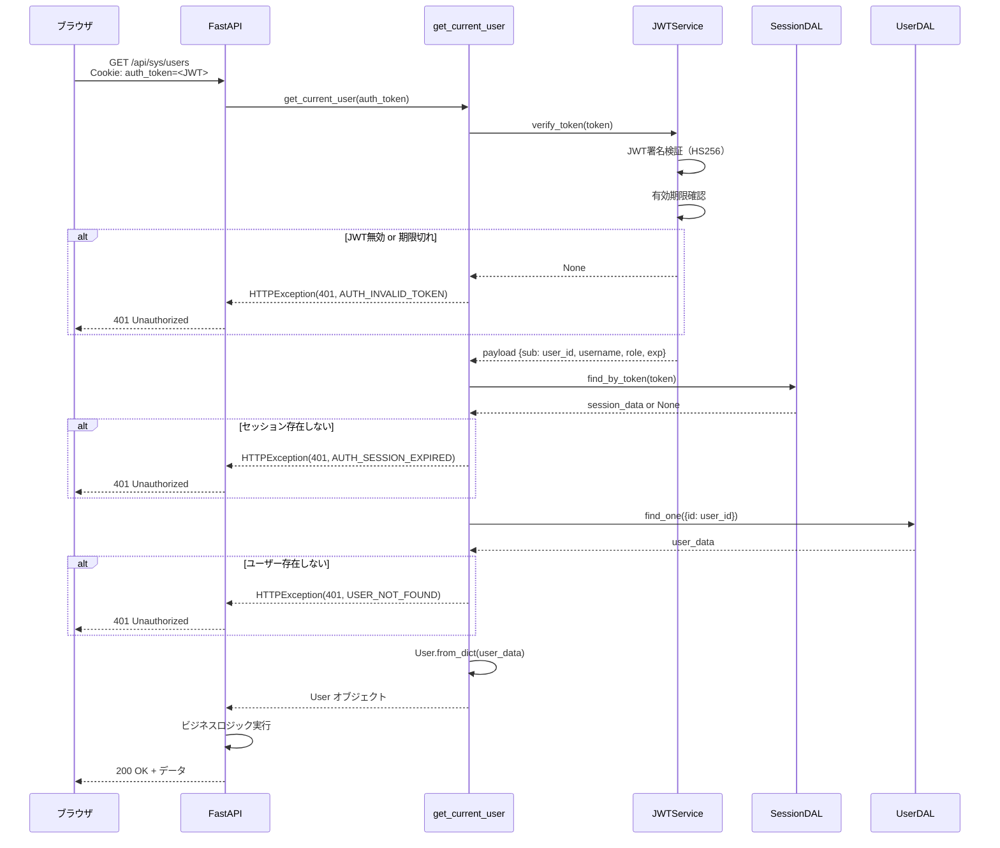
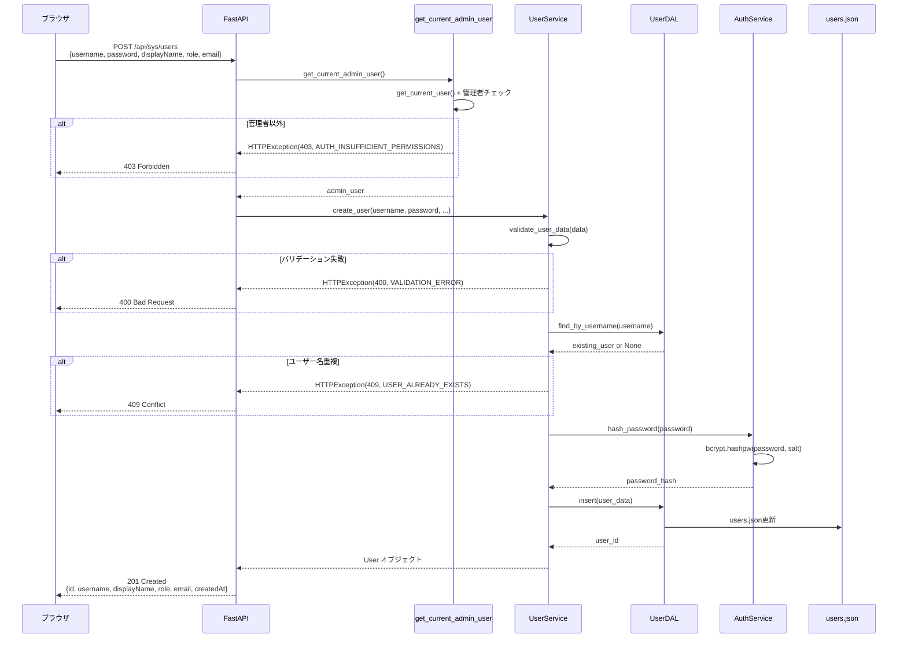
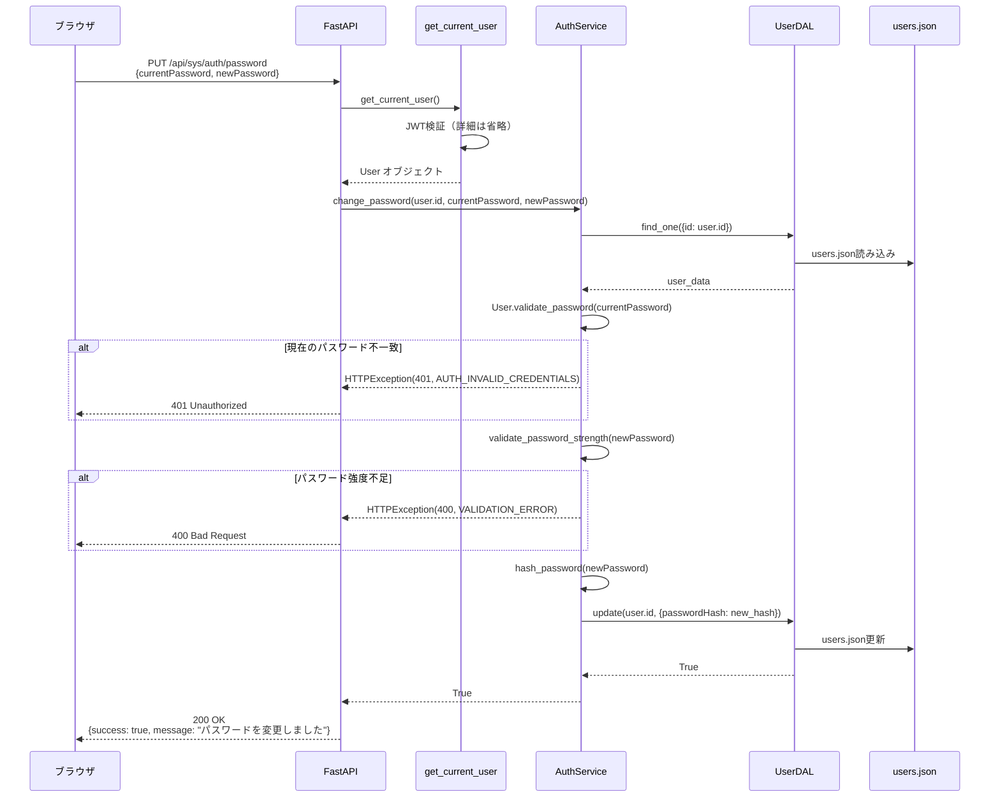
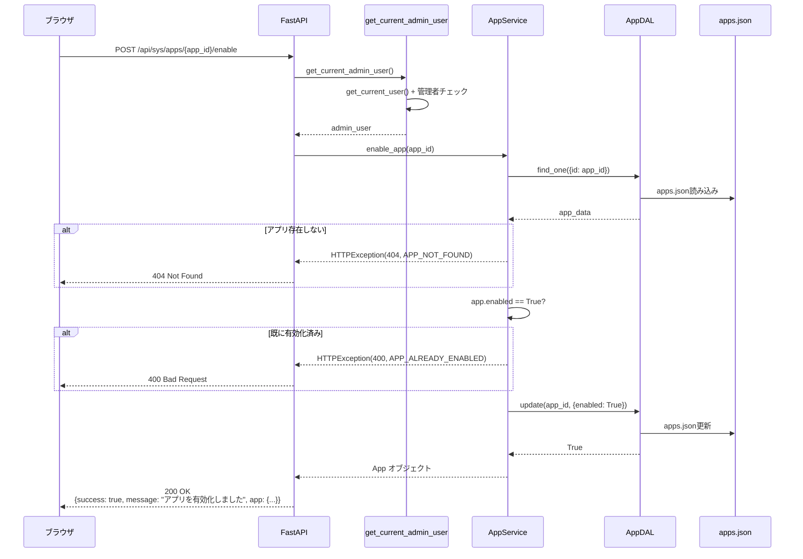
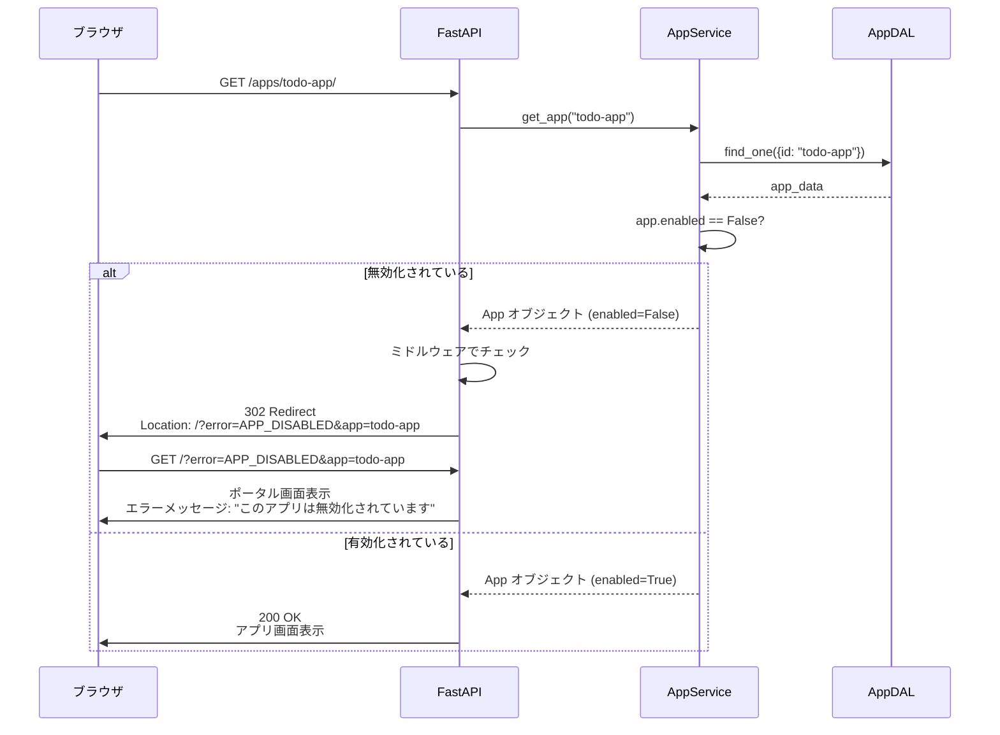
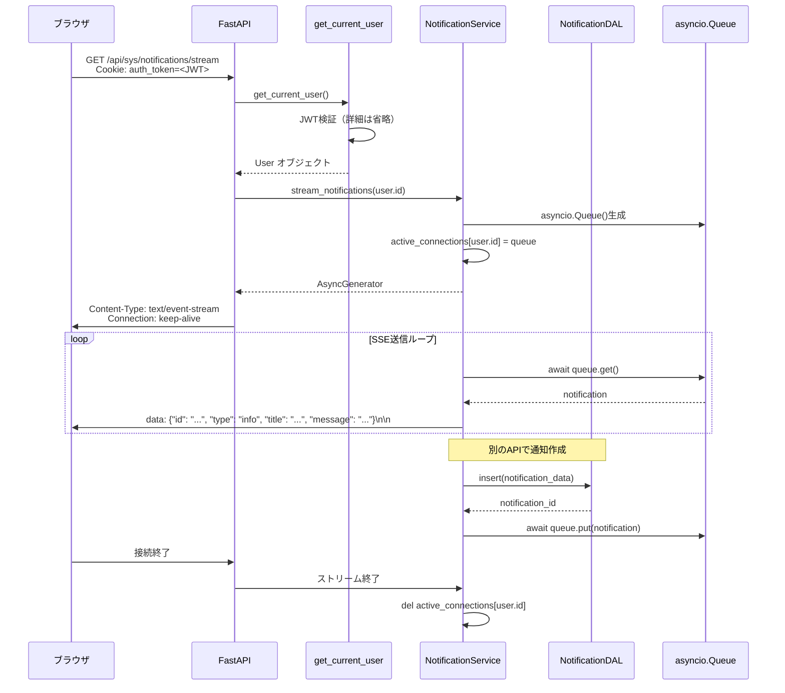
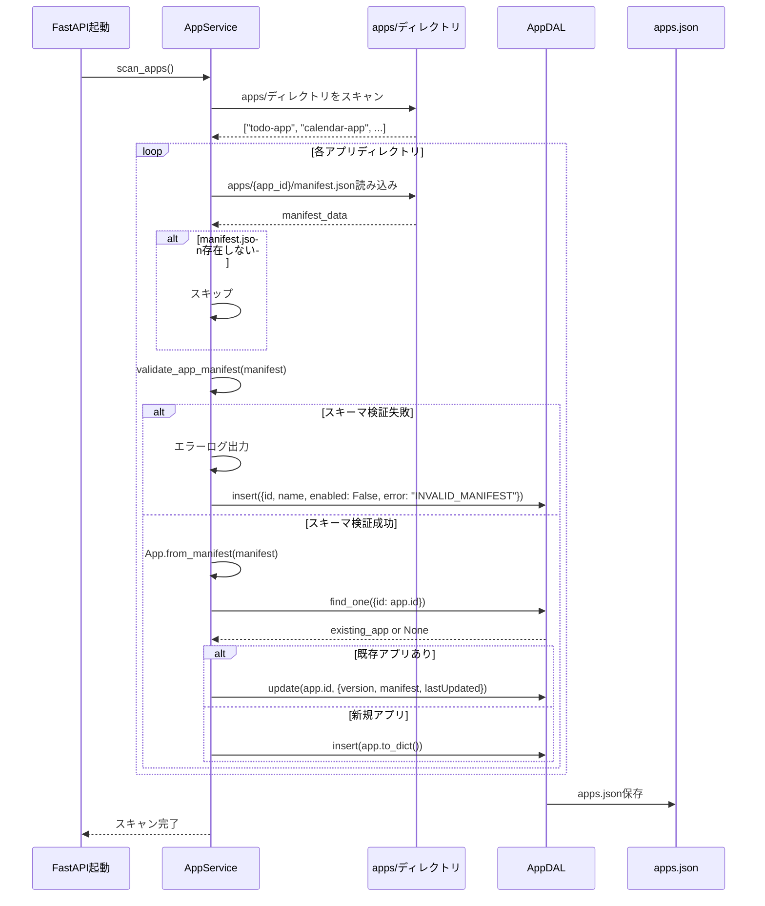

# シーケンス図（システム共通基盤）

| 項目 | 内容 |
|------|------|
| 作成日 | 2026年5月28日 |
| バージョン | 1.0 |
| 対象 | システム共通基盤（sys） |
| 工程 | 工程3: 詳細設計 |

---

## 1. ログインフロー（JWT発行・検証）

```mermaid
sequenceDiagram
    participant Browser as ブラウザ
    participant FastAPI as FastAPI
    participant AuthService as AuthService
    participant JWTService as JWTService
    participant UserDAL as UserDAL
    participant SessionDAL as SessionDAL
    participant JSONFile as users.json

    %% ログインリクエスト
    Browser->>FastAPI: POST /api/sys/auth/login<br/>{username, password}
    FastAPI->>AuthService: authenticate(username, password)
    
    %% ユーザー検証
    AuthService->>UserDAL: find_by_username(username)
    UserDAL->>JSONFile: ファイル読み込み
    JSONFile-->>UserDAL: ユーザーデータ
    UserDAL-->>AuthService: user_data
    
    %% パスワード検証
    AuthService->>AuthService: User.validate_password(password)
    alt パスワード不一致
        AuthService-->>FastAPI: HTTPException(401, AUTH_INVALID_CREDENTIALS)
        FastAPI-->>Browser: 401 Unauthorized
    end
    
    %% JWT生成
    AuthService->>JWTService: create_token(user)
    JWTService->>JWTService: JWT署名（HS256）
    JWTService-->>AuthService: token
    
    %% 最終ログイン日時更新
    AuthService->>UserDAL: update_last_login(user.id)
    UserDAL->>JSONFile: ファイル更新
    
    %% セッション作成
    AuthService->>SessionDAL: insert(session_data)
    SessionDAL->>JSONFile: sessions/<session_id>.json保存
    
    %% レスポンス
    AuthService-->>FastAPI: (user, token)
    FastAPI->>Browser: Set-Cookie: auth_token=<JWT>; HttpOnly; SameSite=Strict
    FastAPI->>Browser: 200 OK<br/>{success: true, user: {...}}
```

**詳細説明**:
1. ブラウザが `/api/sys/auth/login` にPOSTリクエスト
2. `AuthService.authenticate()` がユーザー検証
3. `UserDAL.find_by_username()` でユーザー情報を取得
4. `User.validate_password()` でパスワード検証（bcrypt）
5. `JWTService.create_token()` でJWT生成（HS256署名）
6. `UserDAL.update_last_login()` で最終ログイン日時を更新
7. `SessionDAL.insert()` でセッション情報を保存
8. JWT Cookieをセット（`HttpOnly`, `SameSite=Strict`）
9. ユーザー情報を返却

---

## 2. JWT検証フロー（保護されたAPIへのアクセス）



**詳細説明**:
1. ブラウザが保護されたAPIにリクエスト（JWT Cookieを含む）
2. FastAPIが `get_current_user` 依存関係を実行
3. `JWTService.verify_token()` でJWT署名と有効期限を検証
4. `SessionDAL.find_by_token()` でセッション存在確認
5. `UserDAL.find_one()` でユーザー情報を取得
6. `User` オブジェクトを生成してAPIハンドラーに渡す
7. ビジネスロジックを実行してレスポンスを返す

---

## 3. ログアウトフロー

```mermaid
sequenceDiagram
    participant Browser as ブラウザ
    participant FastAPI as FastAPI
    participant Dependency as get_current_user
    participant SessionDAL as SessionDAL
    participant JSONFile as sessions/

    %% ログアウトリクエスト
    Browser->>FastAPI: POST /api/sys/auth/logout<br/>Cookie: auth_token=<JWT>
    FastAPI->>Dependency: get_current_user(auth_token)
    Dependency->>Dependency: JWT検証（詳細は省略）
    Dependency-->>FastAPI: User オブジェクト
    
    %% セッション削除
    FastAPI->>SessionDAL: find_by_token(token)
    SessionDAL-->>FastAPI: session_data
    FastAPI->>SessionDAL: delete(session_id)
    SessionDAL->>JSONFile: sessions/<session_id>.json削除
    SessionDAL->>JSONFile: sessions.json更新
    SessionDAL-->>FastAPI: True
    
    %% Cookie削除
    FastAPI->>Browser: Set-Cookie: auth_token=; Max-Age=0
    FastAPI->>Browser: 200 OK<br/>{success: true, message: "ログアウトしました"}
```

**詳細説明**:
1. ブラウザが `/api/sys/auth/logout` にPOSTリクエスト
2. JWT検証（`get_current_user`）
3. `SessionDAL.find_by_token()` でセッション情報を取得
4. `SessionDAL.delete()` でセッションを削除
5. JWT Cookieを削除（`Max-Age=0`）
6. ログアウト成功レスポンスを返却

---

## 4. ユーザー登録フロー



**詳細説明**:
1. 管理者がユーザー登録APIにリクエスト
2. `get_current_admin_user` で管理者権限を確認
3. `UserService.validate_user_data()` でバリデーション
4. `UserDAL.find_by_username()` でユーザー名重複チェック
5. `AuthService.hash_password()` でパスワードをハッシュ化（bcrypt）
6. `UserDAL.insert()` でユーザー情報を保存
7. 作成されたユーザー情報を返却

---

## 5. パスワード変更フロー



**詳細説明**:
1. ユーザーがパスワード変更APIにリクエスト
2. `get_current_user` でJWT検証
3. `AuthService.change_password()` を呼び出し
4. 現在のパスワードを検証（bcrypt）
5. 新しいパスワードの強度をチェック（8文字以上など）
6. 新しいパスワードをハッシュ化（bcrypt）
7. `UserDAL.update()` でパスワードを更新
8. パスワード変更成功レスポンスを返却

---

## 6. アプリ有効化フロー



**詳細説明**:
1. 管理者がアプリ有効化APIにリクエスト
2. `get_current_admin_user` で管理者権限を確認
3. `AppDAL.find_one()` でアプリ情報を取得
4. アプリが既に有効化済みかチェック
5. `AppDAL.update()` で `enabled` を `True` に更新
6. アプリ有効化成功レスポンスを返却

---

## 7. 無効化アプリアクセス拒否フロー（ポータルリダイレクト）



**詳細説明**:
1. ユーザーが無効化されたアプリにアクセス
2. FastAPIミドルウェアが `/apps/{app_id}/` のリクエストを検知
3. `AppService.get_app()` でアプリ情報を取得
4. `app.enabled` が `False` の場合、ポータルにリダイレクト
5. ポータル画面でエラーメッセージを表示

**ミドルウェア実装イメージ**:

```python
@app.middleware("http")
async def check_app_enabled(request: Request, call_next):
    if request.url.path.startswith("/apps/"):
        app_id = request.url.path.split("/")[2]
        app_service = get_app_service()
        app = app_service.get_app(app_id)
        if not app.enabled:
            return RedirectResponse(url=f"/?error=APP_DISABLED&app={app_id}", status_code=302)
    return await call_next(request)
```

---

## 8. SSE通知配信フロー



**詳細説明**:
1. ブラウザが `/api/sys/notifications/stream` にSSE接続
2. `get_current_user` でJWT検証
3. `NotificationService.stream_notifications()` でAsyncGeneratorを生成
4. `active_connections` にユーザーIDとQueueを登録
5. SSEレスポンスヘッダーを送信（`Content-Type: text/event-stream`）
6. 通知がキューに追加されるたびにSSEでブラウザに送信
7. 接続終了時、`active_connections` から削除

**SSEデータフォーマット**:

```
data: {"id": "notif_001", "type": "info", "title": "新しいTODOが追加されました", "message": "「プロジェクト計画書を作成」が追加されました", "createdAt": "2026-05-28T10:00:00Z"}

data: {"id": "notif_002", "type": "success", "title": "TODOが完了しました", "message": "「テストコード作成」が完了しました", "createdAt": "2026-05-28T11:00:00Z"}
```

---

## 9. アプリ起動時のmanifest.jsonスキャンフロー



**詳細説明**:
1. FastAPI起動時に `AppService.scan_apps()` を実行
2. `apps/` ディレクトリをスキャン
3. 各アプリの `manifest.json` を読み込み
4. `validate_app_manifest()` でスキーマ検証
5. 検証失敗時はエラー状態で登録
6. 検証成功時は `App.from_manifest()` でインスタンス生成
7. 既存アプリの場合は更新、新規アプリの場合は挿入
8. `apps.json` に保存

---

## 10. まとめ

### 10.1 主要フロー一覧

| フロー | エンドポイント | 主要クラス |
|--------|---------------|-----------|
| ログイン | `POST /api/sys/auth/login` | `AuthService`, `JWTService`, `UserDAL`, `SessionDAL` |
| JWT検証 | 全保護API | `get_current_user`, `JWTService`, `SessionDAL`, `UserDAL` |
| ログアウト | `POST /api/sys/auth/logout` | `SessionDAL` |
| ユーザー登録 | `POST /api/sys/users` | `UserService`, `UserDAL`, `AuthService` |
| パスワード変更 | `PUT /api/sys/auth/password` | `AuthService`, `UserDAL` |
| アプリ有効化 | `POST /api/sys/apps/{app_id}/enable` | `AppService`, `AppDAL` |
| 無効化アプリアクセス拒否 | `GET /apps/{app_id}/` | `AppService`, ミドルウェア |
| SSE通知配信 | `GET /api/sys/notifications/stream` | `NotificationService`, `NotificationDAL` |
| アプリスキャン | 起動時 | `AppService`, `AppDAL` |

### 10.2 セキュリティポイント

| 観点 | 実装内容 |
|------|---------|
| **JWT検証** | 全保護APIで `get_current_user` 依存関係を必須化 |
| **パスワードハッシュ化** | bcrypt（コスト10以上） |
| **Cookie設定** | `HttpOnly`, `SameSite=Strict`, `Secure`（本番） |
| **セッション管理** | JWTとセッションDBの両方で検証 |
| **管理者権限** | `get_current_admin_user` 依存関係で `role == "admin"` をチェック |
| **エラーメッセージ** | 詳細情報を漏らさない（ユーザー名の存在有無など） |

### 10.3 次工程への引き継ぎ

- 工程4（コーディング）では、このシーケンス図に基づいて実装を行う
- 各フローの詳細なエラーハンドリングは `error-handling.md` を参照
- テストケース設計は `test-cases.md` を参照

---

**トレーサビリティ**: この設計書は工程2の基本設計書（architecture.md, api-design.md）および工程3の `class-design.md` に基づいています。
